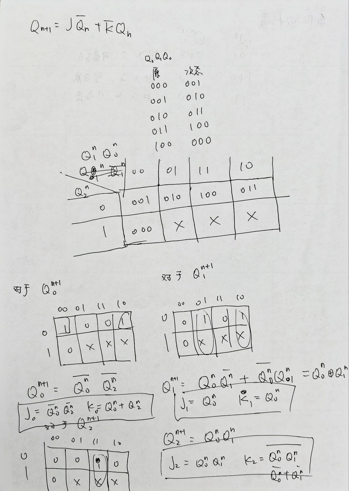
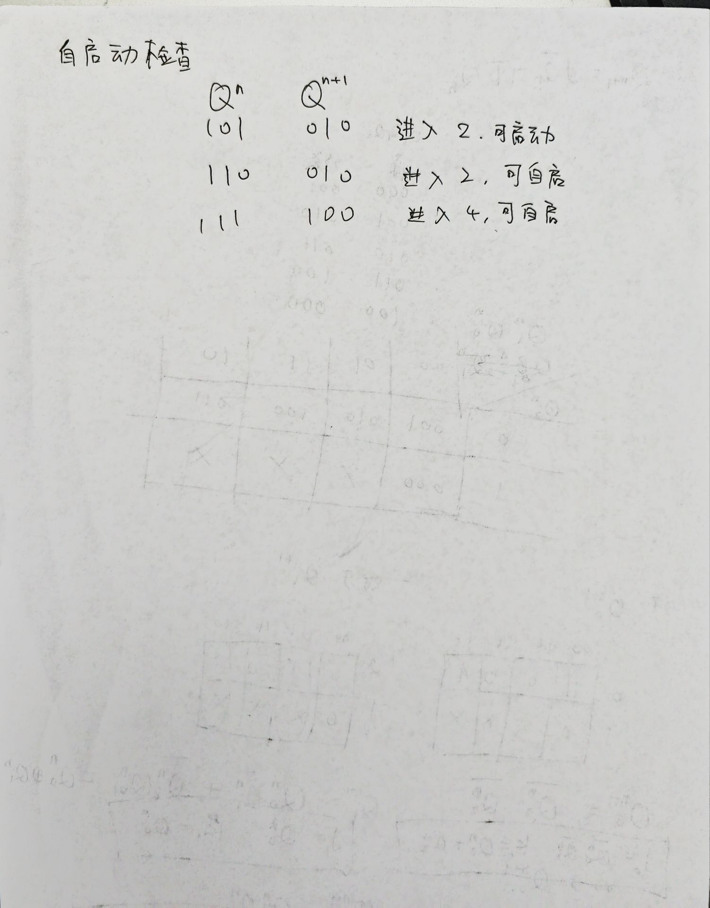
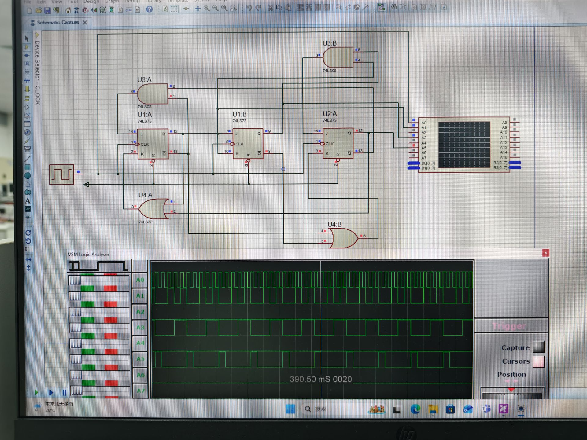
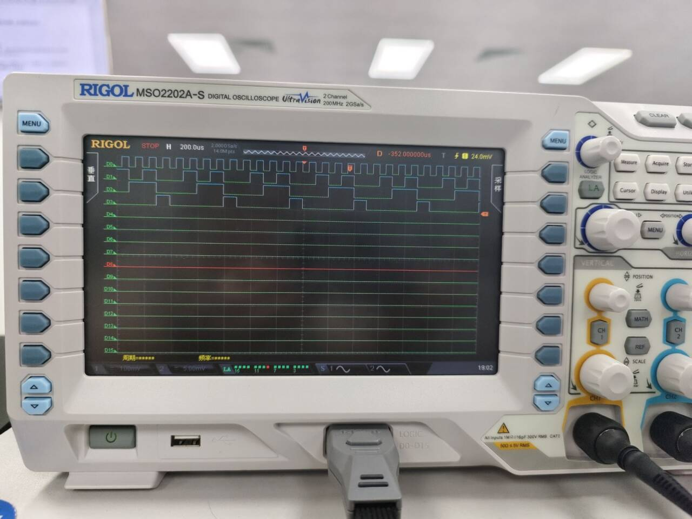

# 数字电路实验报告（期末）

**姓名：** 廖海涛
**学号：** 24344064
**日期：** 2026-06-09

## 一、实验题目

用 JK 触发器设计一个同步五进制加法计数器，并检查能否自启动。

## 二、实验设备

1. 数字电路实验箱、逻辑分析仪。
2. 主要器件：双 JK 触发器 74LS73 × 2、门电路若干。

## 三、实验原理

### 1. 五进制加法计数器的状态转移

五进制加法计数器共有 5 个有效状态：000 → 001 → 010 → 011 → 100 → 000（循环）。使用 3 个 JK 触发器，状态变量记为 $Q_2 Q_1 Q_0$。列出各现态的次态关系：

| 现态 ($n$) | 次态 ($n+1$) |
|:---:|:---:|
| $Q_2 Q_1 Q_0 = 000$ | 001 |
| 001 | 010 |
| 010 | 011 |
| 011 | 100 |
| 100 | 000 |

其余 3 个状态（101、110、111）为无效状态，需在自启动分析中检验其能否自动进入有效循环。

### 2. 状态方程推导

根据上述状态转移关系，分别画出 $Q_0^{n+1}$、$Q_1^{n+1}$、$Q_2^{n+1}$ 关于 $Q_2^n Q_1^n Q_0^n$ 的卡诺图，并化简得到状态方程：

$$
\begin{aligned}
Q_0^{n+1} &= \overline{Q_0^n} \cdot \overline{Q_2^n} \\[4pt]
Q_1^{n+1} &= Q_0^n \oplus Q_1^n \\[4pt]
Q_2^{n+1} &= Q_0^n \cdot Q_1^n
\end{aligned}
$$

### 3. JK 触发器驱动方程推导

JK 触发器的特性方程为 $Q^{n+1} = J \overline{Q^n} + \overline{K} Q^n$。将上述状态方程与特性方程对照，分离出各触发器的 $J$、$K$ 驱动方程：

**FF0 驱动方程：**

由 $Q_0^{n+1} = \overline{Q_0^n} \cdot \overline{Q_2^n} + 0 \cdot Q_0^n$，可得：

$$
J_0 = \overline{Q_0^n} \cdot \overline{Q_2^n}, \quad K_0 = Q_0^n + Q_2^n
$$

验证：当 $J_0 = \overline{Q_0^n} \cdot \overline{Q_2^n}$、$K_0 = 1$ 时（$Q_0^n + Q_2^n$ 包含了 $Q_0^n = 1$ 的情况），$Q_0^{n+1} = J_0 \overline{Q_0^n} + \overline{K_0} Q_0^n = \overline{Q_0^n}\,\overline{Q_2^n} \cdot \overline{Q_0^n} + 0 = \overline{Q_0^n}\,\overline{Q_2^n}$，与状态方程一致。

**FF1 驱动方程：**

由 $Q_1^{n+1} = Q_0^n \oplus Q_1^n = Q_0^n \overline{Q_1^n} + \overline{Q_0^n} Q_1^n$，可得：

$$
J_1 = Q_0^n, \quad K_1 = Q_0^n
$$

**FF2 驱动方程：**

由 $Q_2^{n+1} = Q_0^n Q_1^n = Q_0^n Q_1^n \cdot \overline{Q_2^n} + 0 \cdot Q_2^n$，可得：

$$
J_2 = Q_0^n \cdot Q_1^n, \quad K_2 = \overline{Q_0^n Q_1^n} = \overline{Q_0^n} + \overline{Q_1^n}
$$

### 4. 自启动验证

三个无效状态（101、110、111）在现行驱动方程下的次态分析：

- **现态 101**：$Q_2^n=1, Q_1^n=0, Q_0^n=1$
  - $Q_0^{n+1} = \overline{1} \cdot \overline{1} = 0$
  - $Q_1^{n+1} = 1 \oplus 0 = 1$
  - $Q_2^{n+1} = 1 \cdot 0 = 0$
  - 次态 = **010**（有效状态）

- **现态 110**：$Q_2^n=1, Q_1^n=1, Q_0^n=0$
  - $Q_0^{n+1} = \overline{0} \cdot \overline{1} = 0$
  - $Q_1^{n+1} = 0 \oplus 1 = 1$
  - $Q_2^{n+1} = 0 \cdot 1 = 0$
  - 次态 = **010**（有效状态）

- **现态 111**：$Q_2^n=1, Q_1^n=1, Q_0^n=1$
  - $Q_0^{n+1} = \overline{1} \cdot \overline{1} = 0$
  - $Q_1^{n+1} = 1 \oplus 1 = 0$
  - $Q_2^{n+1} = 1 \cdot 1 = 1$
  - 次态 = **100**（有效状态）

所有无效状态均能在下一个时钟沿自动进入有效状态，**电路具备自启动能力**，无需额外修改设计。

### 

## 五、方法与步骤

1. 列出五进制计数器的 5 个有效状态及其次态关系，画出状态转移表。
2. 由状态转移表绘制 $Q_0^{n+1}$、$Q_1^{n+1}$、$Q_2^{n+1}$ 的卡诺图，化简得到状态方程。
3. 将状态方程与 JK 触发器特性方程 $Q^{n+1} = J\overline{Q^n} + \overline{K}Q^n$ 对比，分离出各触发器的 $J$、$K$ 驱动方程。
4. 对三个无效状态（101、110、111）逐一核算次态，验证自启动能力。
5. 在 Proteus 中搭建电路：使用 2 片 74LS73（共 3 个 JK 触发器）及门电路实现驱动逻辑，接入时钟信号。
6. 运行 Proteus 仿真，用逻辑分析仪观测计数脉冲与状态输出波形。
7. 在实验箱上实物搭建电路，使用逻辑分析仪的数字探头 D₀（计数脉冲）和 D₃～D₁（$Q_2 Q_1 Q_0$）记录波形。

## 六、验证（结果）

### 1. Proteus 仿真

Proteus 仿真中搭建了完整的同步五进制计数器电路，逻辑分析仪显示 $Q_2 Q_1 Q_0$ 状态按 000 → 001 → 010 → 011 → 100 → 000 循环变化，时序与设计要求一致。

### 2. 实验箱逻辑分析仪实测

在实验箱上搭建电路后，使用逻辑分析仪的数字探头 D₀（计数脉冲）和 D₃～D₁（$Q_2 Q_1 Q_0$）记录信号。波形显示计数器按五进制规律正常循环，功能正常，结果与设计一致。
