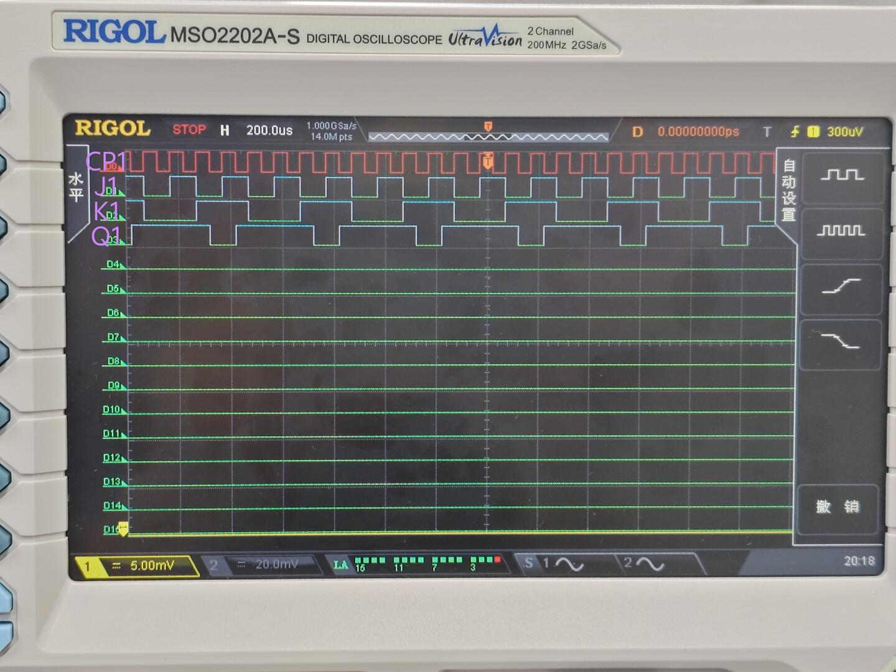
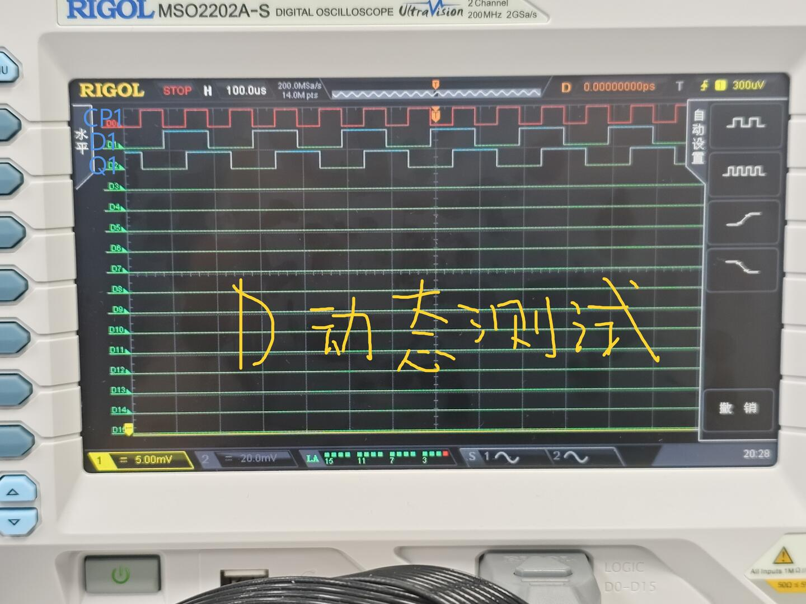
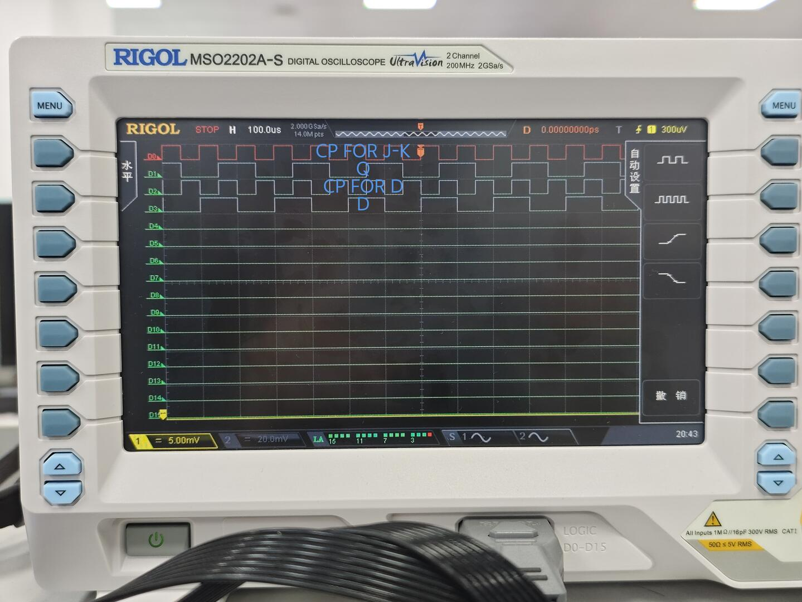
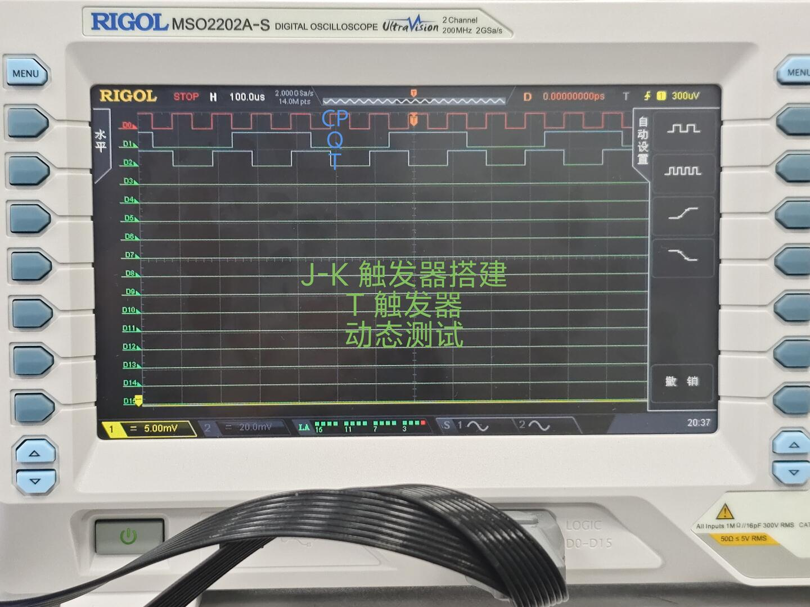

# 数字电路实验报告（实验十）

**姓名：**廖海涛  
**学号：**24344064  
**日期：**2026-04-25

## 一、实验题目

触发器的应用

## 二、实验目的

1. 熟悉 J-K 触发器、D 触发器和 T 触发器的逻辑功能。  
2. 掌握 74LS73、74LS74 的触发方式和使用方法。  
3. 掌握使用 J-K 触发器构成 D 触发器、T 触发器的方法。

## 三、实验设备

1. 数字电路实验箱、逻辑分析仪（示波器数字通道）。  
2. 主要器件：74LS73、74LS74、74LS00、74LS08、74LS20、74LS197。  
3. 连接导线与实验箱板载时钟/按键资源。

## 四、实验原理

触发器是具有记忆功能的时序逻辑基本单元，输出不仅取决于当前输入，也与前一状态有关。

1. **J-K 触发器（74LS73，下降沿触发）**  
   特性方程：
   \[
   Q_{n+1}=J\overline{Q_n}+\overline{K}Q_n
   \]
   当 `J=K=1` 时翻转；`J=1,K=0` 置 1；`J=0,K=1` 置 0；`J=K=0` 保持。

2. **D 触发器（74LS74，上升沿触发）**  
   特性方程：
   \[
   Q_{n+1}=D
   \]
   在有效触发沿到来时，输出锁存输入值。

3. **由 J-K 实现 D、T 的映射关系**  
   - 实现 D 触发器：令 `J=D`，`K=D'`，则下一状态满足 `Q_{n+1}=D`。  
   - 实现 T 触发器：令 `J=K=T`，则 `T=0` 保持、`T=1` 翻转，满足 T 触发器逻辑。

4. **实验连接约束**  
   触发器在用输入端（含清零/置数端）均需接确定电平，不能悬空；先清零再测动态波形，可减少初始状态不确定对观测的影响。

## 五、方法与步骤

1. **J-K 触发器动态测试**  
   将 74LS197 配置为计数输出，分别送入 74LS73 的 `J、K`；时钟接入 `CP`，清零端接按键负脉冲。先执行一次清零，再同步观察 `CP、J、K、Q` 波形及相位关系。

2. **D 触发器动态测试**  
   将 74LS197 输出送入 74LS74 的 `D`，同源时钟送入 `CP`，异步控制端按要求固定电平并先清零。观察 `CP、D、Q` 三路波形，确认在有效触发沿完成锁存。

3. **利用 J-K 实现 D 触发器**  
   用门电路构造 `K=\overline{D}`，并将 `J=D`、`K=D'` 接入 74LS73，完成静态与动态输入切换测试，记录 `D` 与 `Q` 的对应关系。

4. **利用 J-K 实现 T 触发器**  
   将同一控制信号 `T` 同时送入 `J`、`K`，构成下降沿触发 T 触发器。通过 `T=0/1` 两类输入和连续时钟，观察“保持/翻转”行为。

## 六、验证（结果）

### 1. J-K 触发器动态功能测试

从波形可见，`Q` 在有效触发沿按 `J、K` 组合更新；在 `J=K=1` 条件下出现翻转行为，整体与 J-K 触发特性一致。

### 2. D 触发器动态功能测试

`Q` 在有效触发沿对 `D` 完成采样与锁存，触发沿之间保持状态，动态响应符合 D 触发器逻辑。

### 3. J-K 构成 D 触发器测试

实测中 `Q` 与 `D` 在对应触发沿后保持一致，说明 `J=D, K=\overline{D}` 的实现方式有效，功能与目标 D 触发器一致。

### 4. J-K 构成 T 触发器测试

当 `T=0` 时输出保持，当 `T=1` 时输出按触发沿翻转，结果与下降沿触发 T 触发器设计一致。

## 七、思考与提高

### 1. 单稳态触发器与双稳态触发器的区别

1. **稳定状态数量不同**：单稳态仅有一个稳定状态和一个暂稳状态；双稳态有两个稳定状态。  
2. **外部激励作用不同**：单稳态受到触发后只在暂稳态停留一段时间，随后自动回到稳态；双稳态在两稳态间切换后可长期保持，需新的触发信号才改变。  
3. **典型用途不同**：单稳态常用于定时、脉冲整形与延时；双稳态常用于存储 1 位信息、分频与状态保持。

## 八、分析与讨论

1. 本实验的关键在于触发沿判定和输入端规范接线，尤其是异步端与未使用输入端必须固定电平。  
2. 从四组波形观察看，`CP` 与输入/输出的相位关系清晰，可直接对应各触发器特性方程。  
3. 用 J-K 构造 D、T 的方法具有通用性，便于在器件受限时复用现有芯片完成功能替代。  
4. 实验过程中通过“先清零、后加时钟、再观察相位”的顺序，可稳定复现实验现象并降低误判概率。
