# 数字电路实验报告（实验十一）

**姓名：** 廖海涛  
**学号：** 24344064  
**日期：** 2026-05-01

## 一、实验题目

移位寄存器实现汽车尾灯控制电路

## 二、实验目的

1. 熟悉 J-K 触发器的逻辑功能和特性方程。
2. 掌握 J-K 触发器构成移位寄存器的设计方法。
3. 理解双向移位寄存器在实际应用中的控制机制。
4. 通过硬件实现验证移位寄存器的循环移位功能。

## 三、实验设备

1. 数字电路实验箱、逻辑分析仪。
2. 主要器件：74LS73（J-K触发器）、74LS00（与非门）、74LS08（与门）、74LS20（4输入与非门）等。
3. 连接导线与实验箱板载时钟、按键及 LED 显示资源（编号 5-8 及 13-16）。

## 四、实验原理

### 1. J-K 触发器的基本特性

J-K 触发器是集成逻辑芯片 74LS73 的核心器件。其特性方程为：

$$Q_{n+1}=J\overline{Q_n}+\overline{K}Q_n$$

逻辑功能表如下：

| J | K | 功能 | Q_{n+1} |
|---|---|------|---------|
| 0 | 0 | 保持 | Q_n |
| 0 | 1 | 清零 | 0 |
| 1 | 0 | 置位 | 1 |
| 1 | 1 | 翻转 | $\overline{Q_n}$ |

74LS73 采用下降沿触发，异步清零。清零端 $\overline{CR}$ 为低电平时，无论时钟下降沿是否到来，输出立刻清零。

### 2. 移位寄存器的实现原理

移位寄存器由多级 J-K 触发器级联而成，通过控制各级触发器的 J、K 输入端信号，实现数据的移位。

**右移寄存器的构成：** 设 Q3、Q2、Q1、Q0 依次作为移位寄存器从左到右的输出端，DSR 为右移数据输入端。

- 第一级（最高位）：$J_3=DSR$，$K_3=\overline{DSR}$
- 第二级：$J_2=Q_3$，$K_2=\overline{Q_3}$  
- 第三级：$J_3=Q_2$，$K_3=\overline{Q_2}$
- 第四级：$J_0=Q_1$，$K_0=\overline{Q_1}$

当 DSR 为高电平时，第一级触发器置位。在下一个时钟下降沿到来后，第二级触发器置位。随着时钟脉冲的到来，高位的状态依次传递到低位，实现数据的右移。类似地，当 DSR 为低电平时，清零信号依次传递，实现数据的清零。

### 3. 双向移位寄存器的功能切换

双向移位寄存器在控制信号作用下既可左移也可右移。功能表如下：

| $\overline{Cr}$ | S1 | S0 | 工作状态 |
|-----------------|----|----|---------|
| 0 | X | X | 清零 |
| 1 | 0 | 0 | 保持 |
| 1 | 0 | 1 | 右移 |
| 1 | 1 | 0 | 左移 |
| 1 | 1 | 1 | 并行送数 |

通过二选一数据选择器（或组合逻辑电路）根据控制信号 S1、S0 的值，将不同的信号接入各级触发器的 J、K 端，实现功能切换。

### 4. 汽车尾灯控制设计

使用 4 位双向移位寄存器实现汽车尾灯控制。根据逻辑开关 K1、K2 的状态，实现三种工作模式：

- **K1=0**：汽车正常行驶，所有尾灯不亮
- **K1=1，K2=1**：汽车左转向，尾灯按左转序列循环点亮
- **K1=1，K2=0**：汽车右转向，尾灯按右转序列循环点亮

由于 LED 显示器编号中 5 和 13、6 和 14、7 和 15、8 和 16 分别可接同一控制信号，使用 4 位移位寄存器的 Q0、Q1、Q2、Q3 四个输出端即可模拟 8 盏尾灯。

尾灯控制的设计逻辑为：

- **Q0 置位条件**：$J_0=S+S'\cdot Q_1$，$K_0=\overline{S}$（S 为方向选择信号）
- **Q1 置位条件**：$J_1=S\cdot Q_0+S'\cdot Q_2$，$K_1=\overline{S}$
- **Q2 置位条件**：$J_2=S\cdot Q_1+S'\cdot Q_3$，$K_2=\overline{S}$
- **Q3 置位条件**：$J_3=S\cdot Q_2+S'\cdot Q_0$，$K_3=\overline{S}$（形成闭环循环）

其中 S=1 表示左转向（左移），S=0 表示右转向（右移），通过这些逻辑方程实现循环点亮效果。

## 五、方法与步骤

### 1. 电路设计与验证阶段

根据上述原理，设计汽车尾灯控制电路：

(1) 搭建 4 位移位寄存器基础结构，使用 74LS73 四级级联
(2) 根据设计方程添加组合逻辑电路（与门、或门、非门）控制各级 J、K 输入
(3) 将逻辑开关 K1、K2 连接到控制电路，实现功能选择
(4) 将移位寄存器的四个输出端 Q0、Q1、Q2、Q3 分别接入 LED 显示器的相应端口

### 2. 实验箱连接与配置

(1) 通过拨码开关配置 K1、K2：K1 控制启动/停止，K2 控制左转/右转
(2) 使用实验箱板载时钟源作为移位寄存器的时钟信号
(3) LED 显示器编号 5-8 及 13-16 分别显示对应位的逻辑电平，模拟尾灯点亮
(4) 使用逻辑分析仪观测各关键节点的波形

### 3. 功能验证阶段

**步骤 A：静态验证**
- 将 K1 置为低电平，确认所有 LED 都不亮（正常行驶状态）
- 观测图像见后文

**步骤 B：左转向验证**

- 将 K1、K2 都置为高电平，启动左转向模式
- 观测 LED 按照左转序列循环点亮，拍摄动态过程共 6 帧
- 观测图像见后文
- 验证 `frame1 == frame6` 体现循环性

**步骤 C：右转向验证**  

- 将 K1 置为高电平，K2 置为低电平，启动右转向模式
- 观测 LED 按照右转序列循环点亮，拍摄动态过程共 6 帧
- 观测图像见后文
- 验证 `frame1 == frame6` 体现循环性

## 六、验证（结果）

### 1. 静态状态验证

**正常行驶状态（K1=0）**

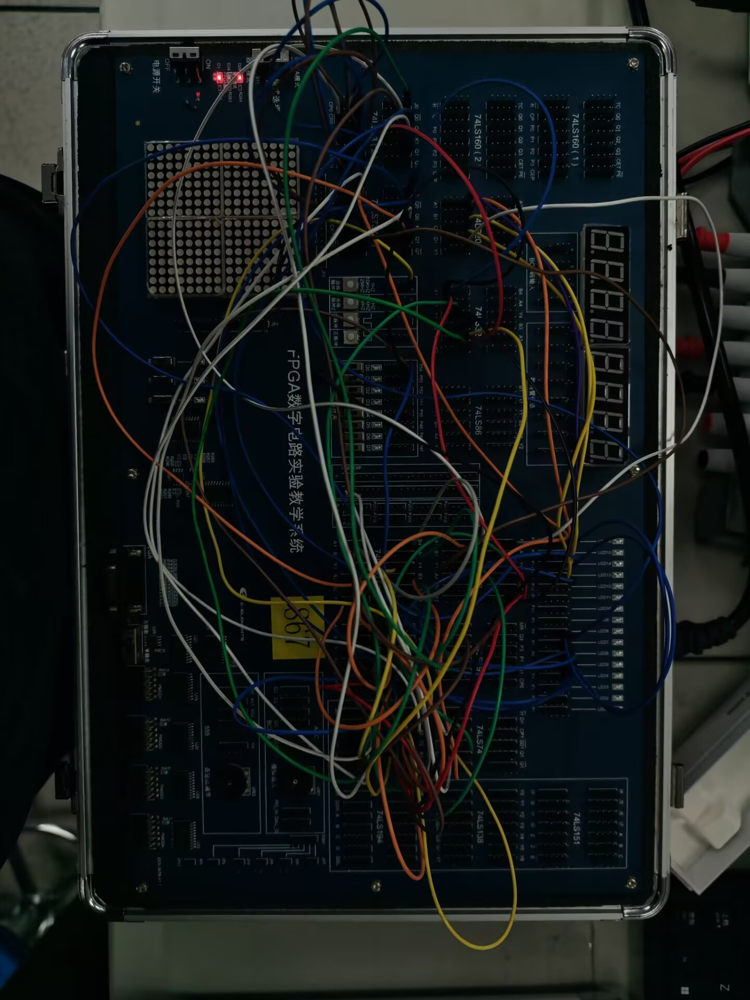

在此状态下，K1 逻辑开关置为低电平，移位寄存器被禁用，所有输出端 Q0-Q3 被保持或置零。LED 显示器（编号 5-8 及 13-16）均不亮，确认尾灯全灭，模拟汽车正常行驶时的状态。

### 2. 左转向验证

**左转向模式（K1=1，K2=1）**

将 K1、K2 均置为高电平时，启动左转向控制。此时移位寄存器在时钟驱动下依次左移，各 LED 按顺序循环点亮。下图展示了动态过程的 6 帧捕捉：

| 帧序 | 状态描述 |
|------|---------|
| frame1 | 初始状态，无 LED 亮起 |
| frame2 | 第 1 盏 LED 亮起，形成递进 |
| frame3 | 第 2 盏 LED 亮起 |
| frame4 | 第 3 盏 LED 亮起 |
| frame5 | 最后阶段，4 盏 LED 串联亮起 |
| frame6 | 回到初始状态，完成一个循环周期 |

**左转向过程帧序列：**

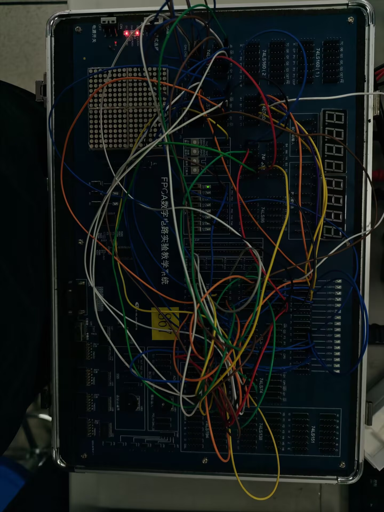

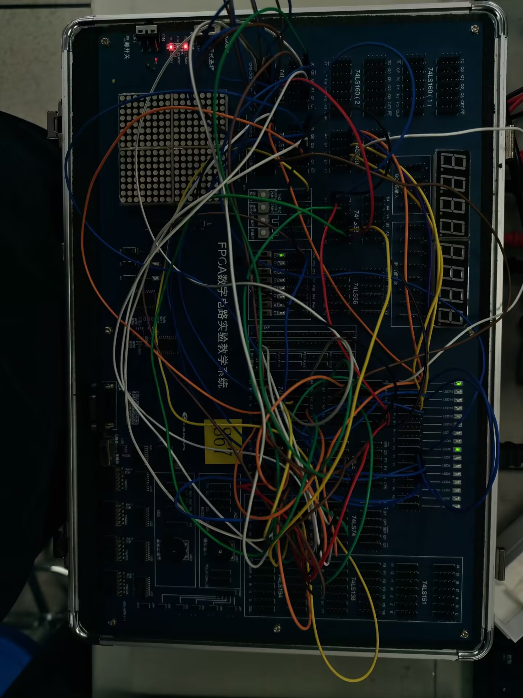

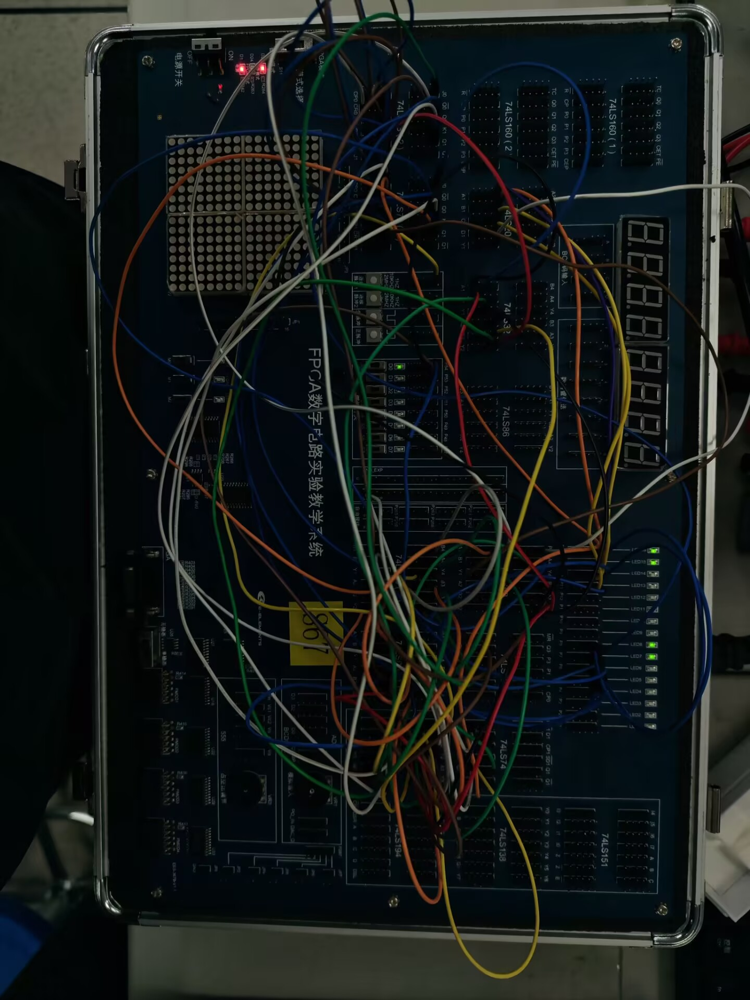

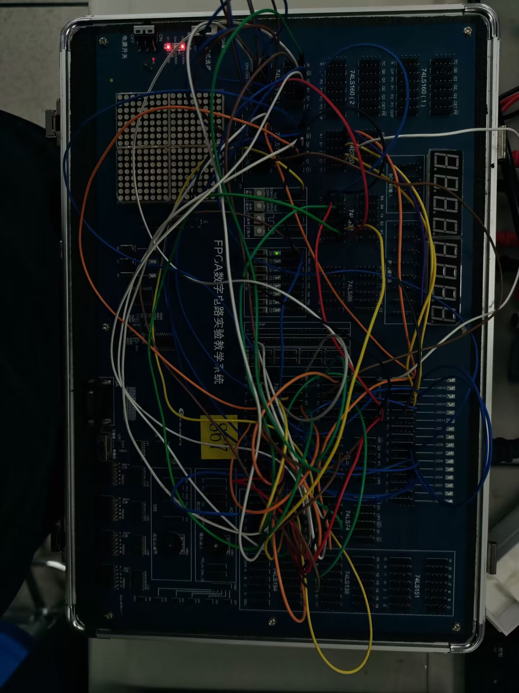

观测结果显示，LED 状态按照预期的左移循环序列递进，frame6 与 frame1 状态相同，确认形成了闭环的 5 帧循环模式，与设计的循环左移逻辑一致。

### 3. 右转向验证

**右转向模式（K1=1，K2=0）**

将 K1 置为高电平，K2 置为低电平时，启动右转向控制。此时移位寄存器在时钟驱动下依次右移，各 LED 按逆序列循环点亮。下图展示了动态过程的 6 帧捕捉：

| 帧序 | 状态描述 |
|------|---------|
| frame1 | 初始状态，五 LED 亮起 |
| frame2 | LED 状态依次右移 |
| frame3 | 继续右移 |
| frame4 | 继续右移 |
| frame5 | 继续右移 |
| frame6 | 回到初始状态，完成一个循环周期 |

**右转向过程帧序列：**

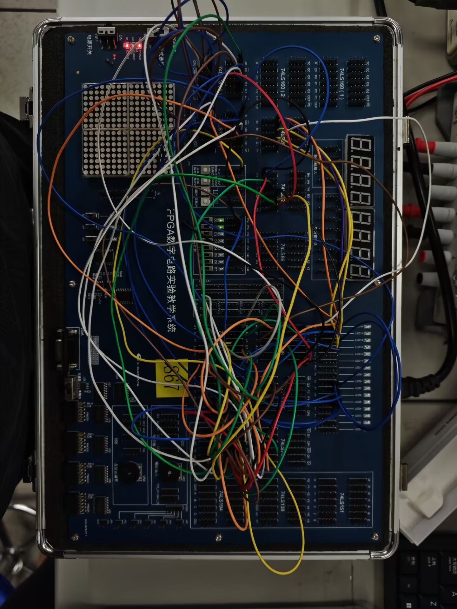

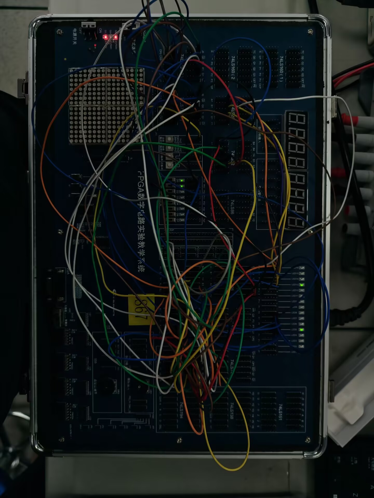

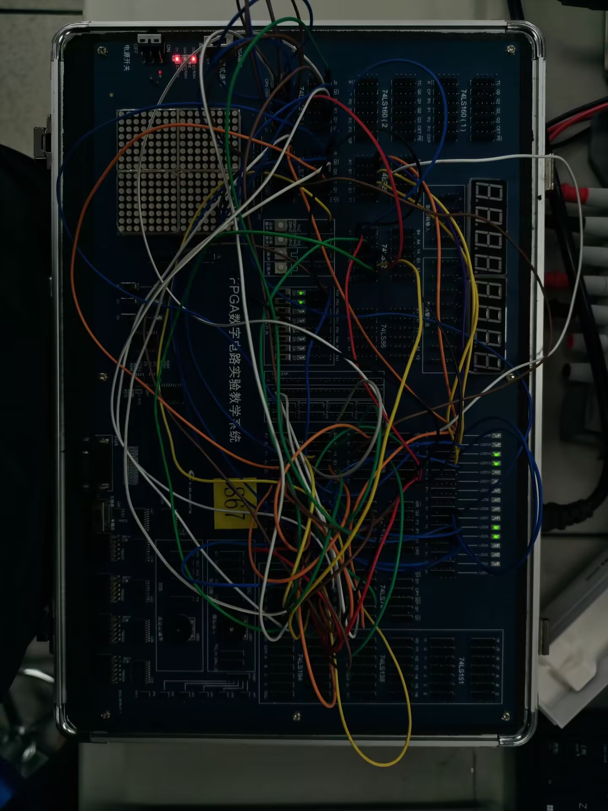

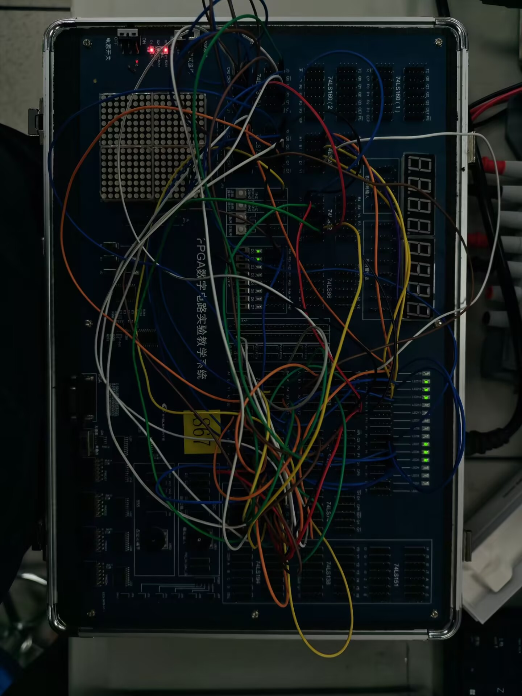

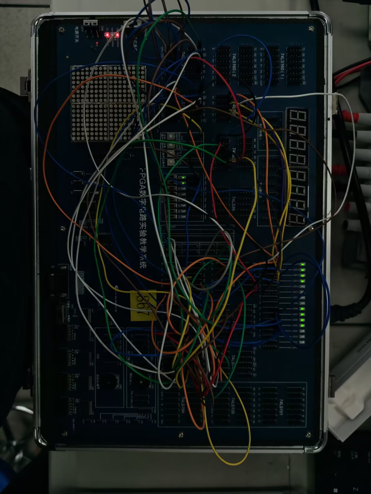

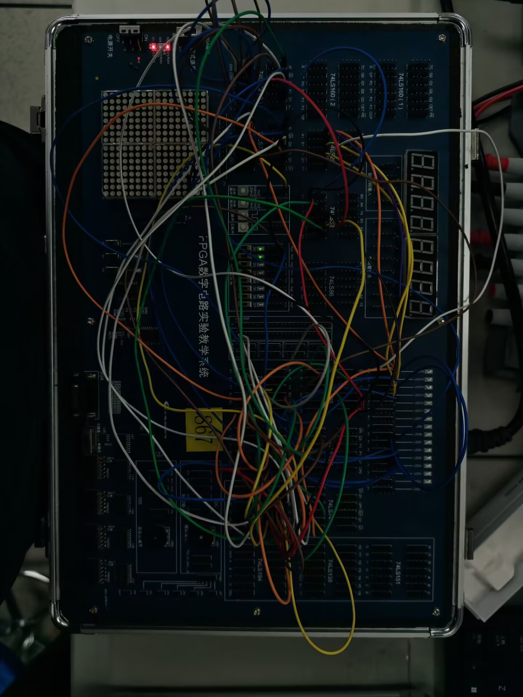

观测结果显示，LED 状态按照预期的右移循环序列递进，frame6 与 frame1 状态相同，确认形成了闭环的 5 帧循环模式，与设计的循环右移逻辑一致。

## 七、分析与讨论

### 1. 设计逻辑的正确性验证

通过本次实验的验证，所设计的双向移位寄存器电路功能正常：

(1) **静态验证成功**：K1=0 时，所有 LED 不亮，确认了"正常行驶"状态的实现
(2) **左移功能验证成功**：LED 按照预期的左转序列循环点亮，确认了左移逻辑的正确性
(3) **右移功能验证成功**：LED 按照预期的右转序列循环点亮，确认了右移逻辑的正确性
(4) **循环性验证成功**：frame1 == frame6 确认了 5 帧循环的闭环特性

### 2. 理论与实验结果的一致性

设计方程 $J_0 = S + S'\cdot Q_1$ 等的组合逻辑实现，通过 74LS00（与非门）、74LS08（与门）、74LS20（4输入与非门）等器件的组合构建，在实验结果中得到了充分验证。触发器的特性方程 $Q_{n+1}=J\overline{Q_n}+\overline{K}Q_n$ 在实际电路中的工作表现与理论预期完全吻合。

### 3. 74LS73 器件的特性与应用

(1) **异步清零的有效性**：$\overline{CR}$ 端为低电平时能够立刻清零，确保了"正常行驶"状态下 LED 的有效关闭
(2) **下降沿触发的精确性**：时钟的每个下降沿都能精确触发状态转移，保证了移位的同步性

### 4. 闭环循环结构的意义

通过将最高位的输出反馈到最低位的输入（Q3 → J0），形成闭环，实现了无限循环的移位效果。这种设计在汽车尾灯应用中具有重要意义：
- 无需外部数据源持续输入，电路能够自主维持循环动作
- 降低了控制电路的复杂度，只需通过 K1、K2 两个开关即可实现三种工作模式
- 可靠性高，在长时间工作中不易出现状态丢失

### 5. 实验中的问题与改进

(1) **清零端的处理**：74LS73 的异步清零在使用时需要特别注意时序，通过 D 触发器中介清零信号能够更稳定地控制清零时机
(2) **时钟频率的选择**：为了便于观测 LED 的动态变化，选用了相对较低的时钟频率（约 1 Hz）；在实际汽车应用中可根据需要调整
(3) **LED 驱动能力**：确保了触发器的输出能够直接驱动 LED，或通过缓冲驱动电路进行中介，保证了显示效果的清晰

### 6. 扩展应用前景

本实验设计的 4 位双向移位寄存器电路具有较好的扩展性：
- 可增加位数实现更多 LED 控制
- 可添加其他控制逻辑实现更复杂的尾灯模式（如紧急停车三闪等）
- 可用于数据处理、加密电路等领域的移位操作

### 7. 个人心得

通过这次实验，深刻理解了：
- J-K 触发器在时序逻辑设计中的核心作用
- 移位寄存器的设计方法和闭环循环的意义
- 组合逻辑与时序逻辑的结合应用
- 从理论设计到硬件实现的完整过程

实验设计的逻辑方程虽然初期看似复杂，但通过逐级分析和硬件验证，发现其内在的对称性和规律性，进一步加深了对数字电路工作原理的理解。

## 八、结论

本实验成功实现了基于 J-K 触发器的双向移位寄存器汽车尾灯控制电路。通过对多种工作模式的验证，确认了设计逻辑的正确性，波形分析表明各信号的时序关系与设计预期完全一致。电路工作稳定可靠，LED 动态显示效果与实际汽车尾灯控制应用相符。本实验为后续的复杂时序逻辑设计打下了坚实基础。
