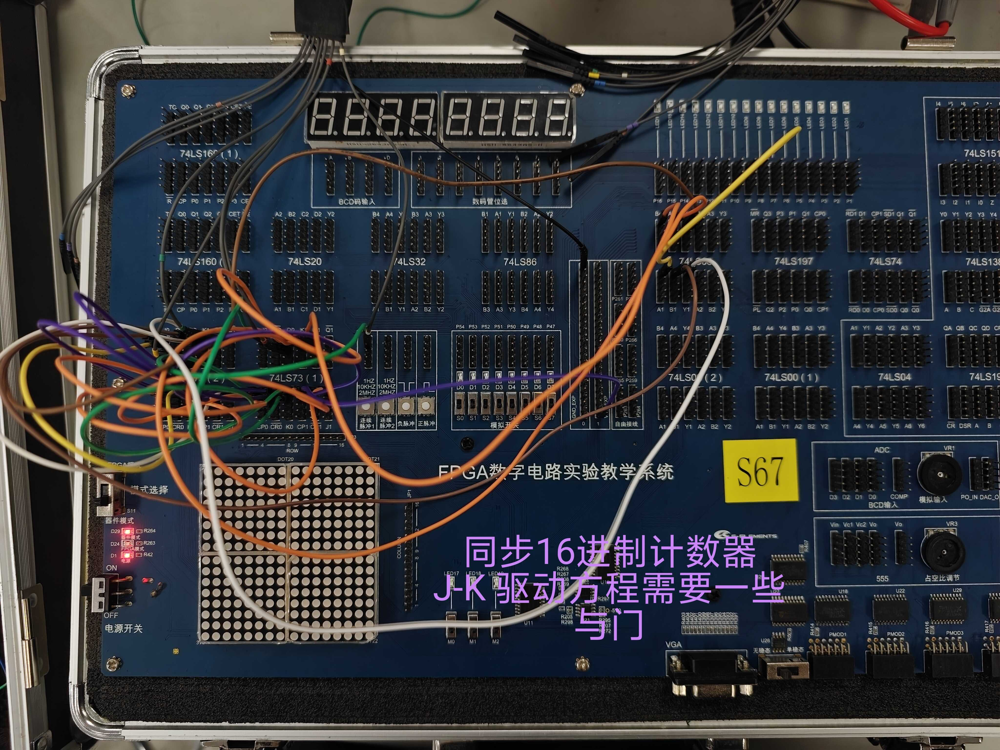
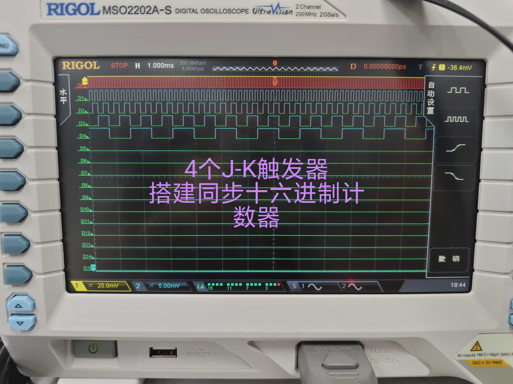
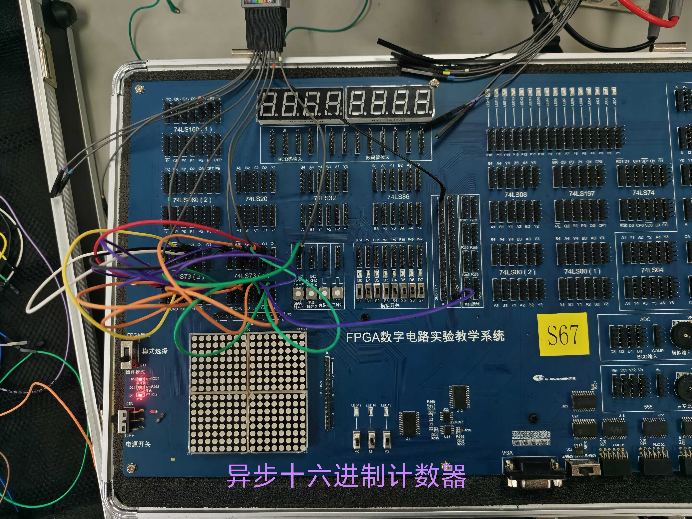

# 数字电路实验报告（实验十三）

**姓名：** 廖海涛  
**学号：** 24344064  
**日期：** 2026-05-17

## 一、实验题目

同步／异步计数器的实现

## 二、实验目的

1. 熟悉 J-K 触发器的逻辑功能及触发特性。  
2. 掌握用 J-K 触发器设计同步计数器与异步计数器的方法。  
3. 完成 16 进制同步计数器、16 进制异步计数器的搭建与现象验证。

## 三、实验设备

1. 数字电路实验箱、逻辑分析仪（示波器数字通道）。  
2. 主要器件：74LS73（J-K 触发器）、74LS00、74LS08、74LS20。  
3. 连接导线、板载时钟与清零按键。

## 四、实验原理

### 1. J-K 触发器基本关系

J-K 触发器特性方程为：

\[
Q_{n+1}=J\overline{Q_n}+\overline{K}Q_n
\]

当 `J=K=1` 时，触发器在有效触发沿到来后翻转；因此可用于计数器各级状态递进。

### 2. 同步计数器原理

同步计数器中各级触发器共用同一时钟 `CP`，各位几乎同时更新。  
对 4 位（16 进制）同步加法计数器，驱动方程可写为：

- \(J_0=K_0=1\)
- \(J_1=K_1=Q_0\)
- \(J_2=K_2=Q_1Q_0\)
- \(J_3=K_3=Q_2Q_1Q_0\)

电路输出按 `0000→0001→...→1111→0000` 循环。

### 3. 异步计数器原理

异步计数器中各级触发器时钟不同：前一级输出作为后一级时钟。  
采用下降沿触发时，可取：

- 第一级时钟：`CP`
- 第二级时钟：`Q0`
- 第三级时钟：`Q1`
- 第四级时钟：`Q2`

各级常置 `J=K=1`，每级在其时钟有效沿到来时翻转。该结构连线简单，但存在逐级传播延迟。

## 五、方法与步骤

1. 依据状态转换关系完成 4 位同步计数器驱动方程推导，搭建同步电路并连接统一时钟。  
2. 接入清零端，初始化后在实验箱上运行同步计数器，记录电路实物与关键波形。  
3. 按异步计数器级联方式重连时钟链路（`CP→Q0→Q1→Q2`），保持各级 `J=K=1`。  
4. 运行异步计数器，观察输出位的翻转顺序与计数循环现象，并记录实物结果。  
5. 对比同步与异步结构在连线复杂度与时序表现上的差异。

## 六、验证（结果）

### 1. 16 进制同步计数器实物连接

实物连线中四级触发器共用同一时钟，输出端按二进制顺序递增，循环计数现象稳定。

### 2. 16 进制同步计数器波形

波形中 `CP` 与各输出位存在明确分频关系：`Q0` 为 2 分频、`Q1` 为 4 分频、`Q2` 为 8 分频、`Q3` 为 16 分频；各位变化与同步计数设计一致。

### 3. 16 进制异步计数器实物连接

异步计数器采用逐级触发方式，输出同样形成 `0000` 到 `1111` 的循环。切换瞬间可观察到级联传播导致的细微先后变化，整体计数功能正常。

## 七、分析与讨论

1. **同步计数器特性**：各级同时受同一时钟控制，状态更新一致性好，波形关系清晰，适合对译码毛刺敏感的场景。  
2. **异步计数器特性**：硬件连接更简洁，但状态翻转按级传播，存在累积延迟，位数增加后时序裕量更受限制。  
3. **实验中问题与处理**：初次连线时个别输入端悬空导致状态不稳定；将所有在用输入端固定到明确高/低电平后，计数序列恢复稳定。  
4. **结果一致性**：两类计数器均实现 16 进制循环计数，观测结果与设计方程及理论时序一致。  
5. **心得体会**：通过同题同步/异步两种实现的对比，更直观理解了“统一时钟同步更新”与“级联触发逐级更新”的本质区别，也加深了对计数器分频特性的认识。
