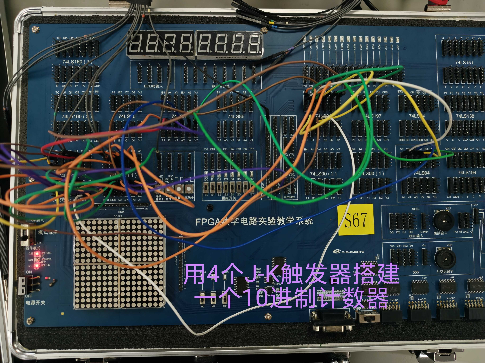
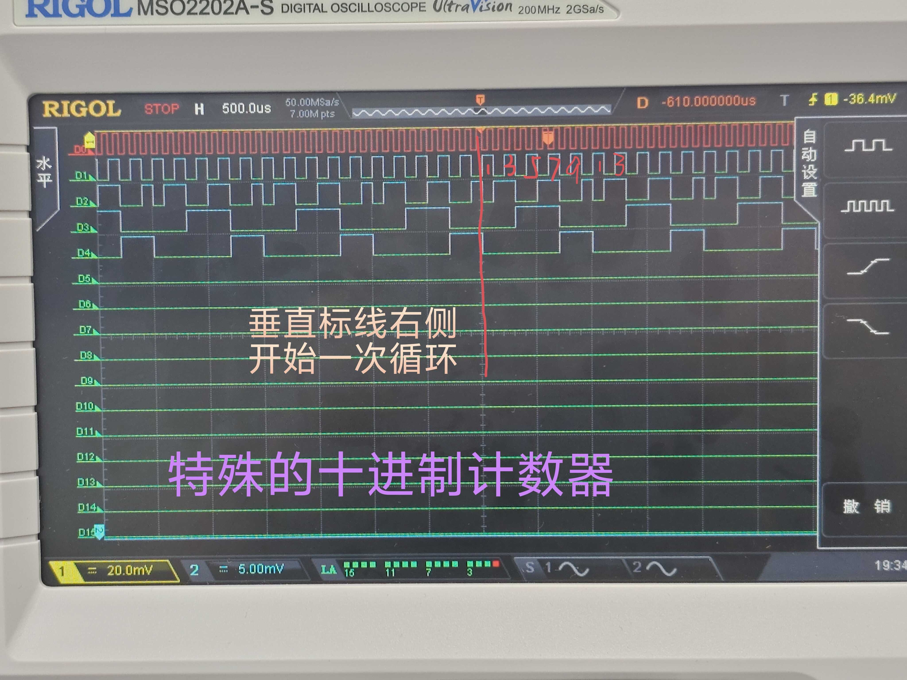

# 数字电路实验报告（实验十四）

**姓名：** 廖海涛  
**学号：** 24344064  
**日期：** 2026-05-17

## 一、实验题目

特殊十进制同步计数器（1→2→…→10→1）的设计与实现

## 二、实验目的

1. 掌握基于 J-K 触发器设计特殊进制同步计数器的方法。  
2. 学会由状态转换关系推导触发器驱动方程。  
3. 理解并验证计数器自启动（非法状态可回到有效循环）的设计思路。  
4. 结合实物连线与波形观测，验证电路工作结果与理论分析的一致性。

## 三、实验设备

1. 数字电路实验箱、逻辑分析仪（示波器数字通道）。  
2. 主要器件：74LS73（J-K 触发器）及基础门电路器件。  
3. 实验导线、板载时钟与清零按键资源。

## 四、实验原理

### 1. J-K 触发器特性方程

J-K 触发器满足：

\[
Q_{n+1}=J\overline{Q_n}+\overline{K}Q_n
\]

因此可由目标次态 \(Q_{n+1}\) 反推各级触发器的 \(J\)、\(K\) 驱动逻辑。

### 2. 特殊十进制计数序列

本实验采用 4 位状态编码，实现：

\[
0001\rightarrow0010\rightarrow\cdots\rightarrow1010\rightarrow0001
\]

即十个有效状态循环（对应十进制 1 到 10），其余 6 个状态作为非法状态处理，并要求具备自恢复能力。

### 3. 驱动方程

结合状态表与卡诺图化简，得到本实验采用的驱动方程：

- \(J_3 = Q_2Q_1Q_0\)  
- \(K_3 = Q_1(\overline{Q_2}+\overline{Q_0})\)  
- \(J_2 = Q_1Q_0,\ \ K_2 = Q_1Q_0\)  
- \(J_1 = Q_0,\ \ K_1 = Q_3+Q_0\)  
- \(J_0 = 1,\ \ K_0 = 1\)

其中 \(Q_0\) 每拍翻转，\(Q_1\sim Q_3\) 在组合逻辑控制下完成特殊序列推进。

## 五、方法与步骤

1. 按目标计数序列列出状态转移表，区分有效状态与非法状态。  
2. 由各位次态关系绘制卡诺图，推导四级 J-K 触发器驱动方程。  
3. 在实验箱完成 4 级 J-K 触发器与组合逻辑连线，统一接入时钟。  
4. 加入清零/初始化操作后运行电路，观察输出状态循环。  
5. 使用逻辑分析仪采集关键波形，记录计数序列与分频关系。  
6. 对非法状态进行次态分析，验证其在有限时钟周期内回到有效循环。

## 六、验证（结果）

### 1. 电路实物连接

实物电路由四级 J-K 触发器构成，同步时钟驱动下输出按设计序列循环，整体计数现象稳定。

### 2. 波形观测结果

观测到各位输出随时钟同步更新，状态迁移顺序与 1→2→…→10→1 的设计目标一致，波形关系清晰。

### 3. 自启动验证

对 6 个非法状态代入驱动方程得到次态如下：

| 非法状态 | 当前状态 \(Q_3Q_2Q_1Q_0\) | 次态 | 迁移结果 |
|---|---|---|---|
| S0 | 0000 | 0001 | 进入有效状态 S1 |
| S11 | 1011 | 0100 | 进入有效状态 S4 |
| S12 | 1100 | 1101 | 经 S13、S14 后进入有效循环 |
| S13 | 1101 | 1110 | 下一拍可进入有效循环通路 |
| S14 | 1110 | 0101 | 进入有效状态 S5 |
| S15 | 1111 | 1000 | 进入有效状态 S8 |

可见非法状态均能在有限拍内回到有效序列，电路具备自启动能力。

## 七、思考与提高

### 1. 为什么特殊进制计数器必须关注自启动

实际电路上电或受干扰后，触发器可能落入非法状态。若设计未考虑自启动，计数器可能陷入无效循环或停滞；加入自启动约束后，系统可自动回归目标序列，提高鲁棒性与可维护性。

### 2. 同步结构相比异步结构的优势

本实验采用同步计数结构，各触发器共用同一时钟，状态更新时刻一致，便于波形观测与逻辑验证；在需要稳定译码输出的场景中，同步结构更容易控制瞬态误差与级联传播影响。

## 八、分析与讨论

1. 本实验的关键是“由状态序列反推驱动方程”，再利用 J-K 特性方程完成门级实现。  
2. 通过将非法状态纳入分析，电路不仅能完成目标计数，还能在异常初态下恢复到正常循环。  
3. 实物现象与波形观测均表明：计数功能正常，状态迁移与设计推导一致。  
4. 该设计方法可扩展到其他特殊进制同步计数器，只需重新定义目标序列并完成对应驱动方程化简。
