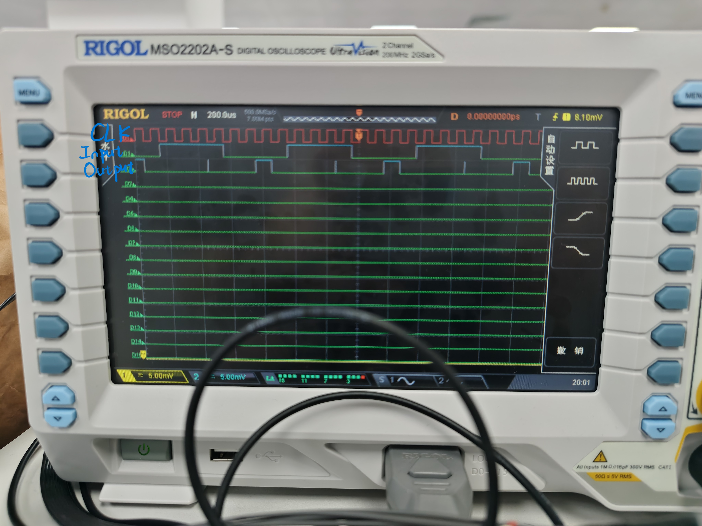
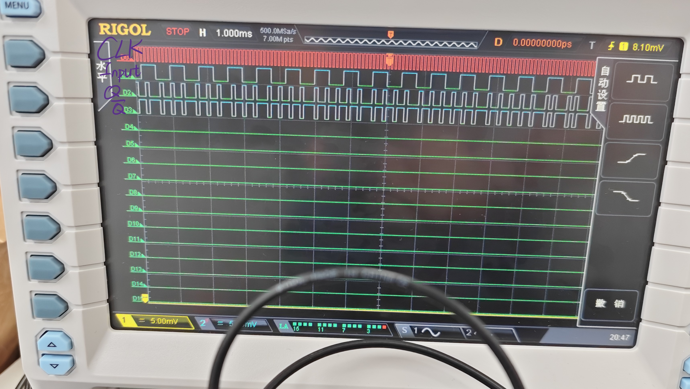

# 数字电路实验报告（实验十六）

**姓名：** 廖海涛  
**学号：** 24344064  
**日期：** 2026-05-26

## 一、实验题目

8421 BCD 码串行检测电路的设计与实现

## 二、实验目的

1. 掌握 Mealy 型时序电路的状态图设计与化简方法。
2. 学会由状态转移表推导 JK 触发器驱动方程及输出方程。
3. 理解串行检测的工作时序与输出时序关系。
4. 通过实物测试验证检测电路的正确性，并分析输出信号的质量问题及其改进方法。

## 三、实验设备

1. 数字电路实验箱、示波器。
2. 主要器件：74LS73（JK 触发器）×3、74LS74（D 触发器）及基础门电路器件。
3. 实验导线、板载时钟与按键资源。

## 四、实验原理

### 1. 8421 BCD 码

8421 BCD 码用 4 位二进制表示十进制 0～9：`0000`～`1001` 为合法码，`1010`～`1111` 为非法码。本实验要求设计一个串行检测电路，输入 $X$ 按时钟节拍从高位到低位逐位串行输入，每 4 个时钟周期对一组 BCD 码进行合法性判断，合法时输出 $Z=1$，否则 $Z=0$。

### 2. Mealy 型状态机设计

采用 Mealy 型电路，输出 $Z$ 同时取决于现态和输入 $X$。按接收位数逐步展开（MSB 优先），并根据等价条件合并状态后得到 8 个状态：

| 状态 | 含义 |
|:---:|:---|
| A | 初始/空闲，已收 0 位 |
| B | 已收 1 位 = `0` |
| C | 已收 1 位 = `1` |
| D | 已收 2 位 = `00` 或 `01`（合并） |
| E | 已收 2 位 = `10` |
| F | 已收 2 位 = `11` |
| G | 已收 3 位，前缀合法 |
| H | 已收 3 位，前缀非法 |

其中：前缀合法（G）时，无论第 4 位是 0 还是 1，最终 BCD 码均合法（$0000\sim1001$），输出必为 1；前缀非法（H）时输出必为 0。

### 3. 状态编码

使用 3 位二进制编码 $Q_2Q_1Q_0$，对应 3 个 JK 触发器：

| 状态 | $Q_2$ | $Q_1$ | $Q_0$ |
|:---:|:---:|:---:|:---:|
| A | 0 | 0 | 0 |
| B | 0 | 0 | 1 |
| C | 0 | 1 | 0 |
| D | 0 | 1 | 1 |
| E | 1 | 0 | 0 |
| F | 1 | 0 | 1 |
| G | 1 | 1 | 0 |
| H | 1 | 1 | 1 |

### 4. 状态转移图

```
             X/Z
    ┌─── 0/0 ──→ B ── 0/0,1/0 ──→ D ── 0/0,1/0 ──→ G ── 0/1,1/1 ──┐
    │                                                                   │
    A                                                                   ↓
    │                                                                   A
    └─── 1/0 ──→ C ── 0/0 ──→ E ── 0/0 ──→ G ─┐                       ↑
                  │         │                    │                       │
                  │         └── 1/0 ──→ H ──────┤                       │
                  │                              │                       │
                  └── 1/0 ──→ F ── 0/0,1/0 ──→ H ┘                       │
                                                                         │
              G: 0/1,1/1 ───────────────────────────────────────────────┘
              H: 0/0,1/0 ───────────────────────────────────────────────┘
```

### 5. 状态转移表与驱动方程推导

由状态转移表结合 JK 触发器特性方程 $Q^{+}=J\overline{Q}+\overline{K}Q$，通过卡诺图化简得到各触发器驱动方程及输出方程：

| 触发器 | $J$ 方程 | $K$ 方程 |
|:---:|:---|:---|
| FF2 | $J_2 = \overline{Q_2} \cdot Q_1$ | $K_2 = Q_2 \cdot Q_1$ |
| FF1 | $J_1 = \overline{Q_1} \cdot (Q_2 + Q_0 + X)$ | $K_1 = Q_1 \cdot (Q_2 + \overline{Q_2}\,\overline{Q_0}\,\overline{X})$ |
| FF0 | $J_0 = \overline{Q_0}\bigl(\overline{Q_2}\,\overline{Q_1}\,\overline{X} + X(Q_2 \oplus Q_1)\bigr)$ | $K_0 = Q_1 \cdot Q_0$ |

**输出方程**：

$$Z = Q_2 \cdot Q_1 \cdot \overline{Q_0}$$

即仅在状态 G（`110`）时输出 1。因为在状态 G 下已收 3 位前缀合法，无论第 4 位是 0 还是 1，最终 BCD 码一定在 $0000\sim1001$ 范围内。该表达式与输入 $X$ 无关，因此在此特例中 Mealy 输出退化为仅由状态决定。

## 五、方法与步骤

1. 按目标检测序列推导原始状态，通过等价条件合并得到 8 状态 Mealy 机。  
2. 分配 3 位二进制状态编码，列出完整状态转移表（含次态与输出）。  
3. 由次态关系绘制各 $J$、$K$ 卡诺图，化简得到 6 个驱动方程与 1 个输出方程。  
4. 在实验箱搭建电路：3 片 JK 触发器（74LS73）配合门电路实现驱动逻辑，接入同步时钟与串行输入 $X$。  
5. 运行电路并观测输出 $Z$，记录关键波形。  
6. 针对 Mealy 输出中的毛刺问题，增加 D 触发器（74LS74）对 $Z$ 进行同步寄存，对比改善前后的波形。

## 六、验证（结果）

### 1. 电路连接图


电路由 3 片 JK 触发器构成状态寄存器，配合与门、或门、异或门实现各级 $J$、$K$ 驱动逻辑。

### 2. 未加 D 触发器时的输出波形



在未对输出 $Z$ 进行同步寄存的情况下，波形中可见组合逻辑输出存在毛刺。这是由于 Mealy 型电路中 $Z$ 直接由门电路产生，输入 $X$ 的异步变化经不同路径传播后在输出端产生竞争冒险。

### 3. 加入 D 触发器后的输出波形



在输出端增加 D 触发器后，$Z$ 在时钟边沿被同步采样，有效消除了组合逻辑毛刺。输出波形干净，仅在合法 BCD 码组的第 4 位时钟沿后产生宽度为一个时钟周期的有效高电平脉冲。

### 4. 结果小结

- 电路能正确检测串行输入的 8421 BCD 码合法性：对 $0000\sim1001$ 输出 $Z=1$，对 $1010\sim1111$ 输出 $Z=0$。  
- 8 状态 Mealy 机在所有 16 种状态-输入组合下的转移均与设计一致。  
- 添加 D 触发器同步输出后，波形稳定无毛刺，改善了输出信号的时序质量。

## 七、思考与提高

### 1. 为何输出 $Z$ 会出现毛刺？D 触发器如何消除毛刺？

Mealy 机的输出 $Z$ 由组合逻辑（现态 $Q$ 与输入 $X$）直接产生。当输入 $X$ 变化时，信号经过不同门路径到达输出端存在传播延迟差异，导致输出端出现短暂的错误电平（毛刺）。在输出端增加 D 触发器后，$Z$ 仅在时钟有效沿被采样并保持一个周期，毛刺在时钟沿之间的时段被隔离，不会出现在最终输出上。

### 2. 本设计的 8 状态方案与 6 状态方案有何区别

6 状态方案在第 3 位接收后将合法与非法前缀合并处理，可能在输出逻辑上引入额外的输入依赖。本设计显式区分了"前缀合法"（G）和"前缀非法"（H）两个状态，使得输出方程退化为 $Z = Q_2 Q_1 \overline{Q_0}$，与 $X$ 无关，简化了输出组合逻辑，同时 8 个状态全部使用，无冗余状态，不需额外处理自启动问题。

### 3. 如何验证非法状态下的电路行为

将 8 个状态全部纳入分析：本设计采用 3 位二进制编码，$000\sim111$ 全部被有效状态占用，因此不存在非法状态。所有 16 种现态-输入组合的次态均已通过 JK 特性方程逐一核算，转移行为完全确定。

## 八、分析与讨论

1. 本实验的核心在于"由检测需求反推状态图、由状态表反推驱动方程"的时序电路设计流程。8 状态 Mealy 机的推导完整覆盖了 BCD 码 MSB 优先串行输入的所有位组合情形。  
2. 输出方程 $Z = Q_2 Q_1 \overline{Q_0}$ 的简化形式得益于本设计将"前缀合法/非法"在第 3 位接收后显式区分为独立状态（G 和 H），避免了对输入 $X$ 的额外依赖，这一简化在实际搭建中减少了门电路数量。  
3. 实物波形中未加 D 触发器时的毛刺现象是 Mealy 机直接组合输出的典型问题，加入一级 D 触发器同步后波形显著改善，验证了"Mealy 输出 + 同步寄存器"在实际工程中的必要性。  
4. 本设计方法可推广至其他固定长度码字的串行检测场景，只需重新定义目标状态图并完成对应的驱动方程化简。
