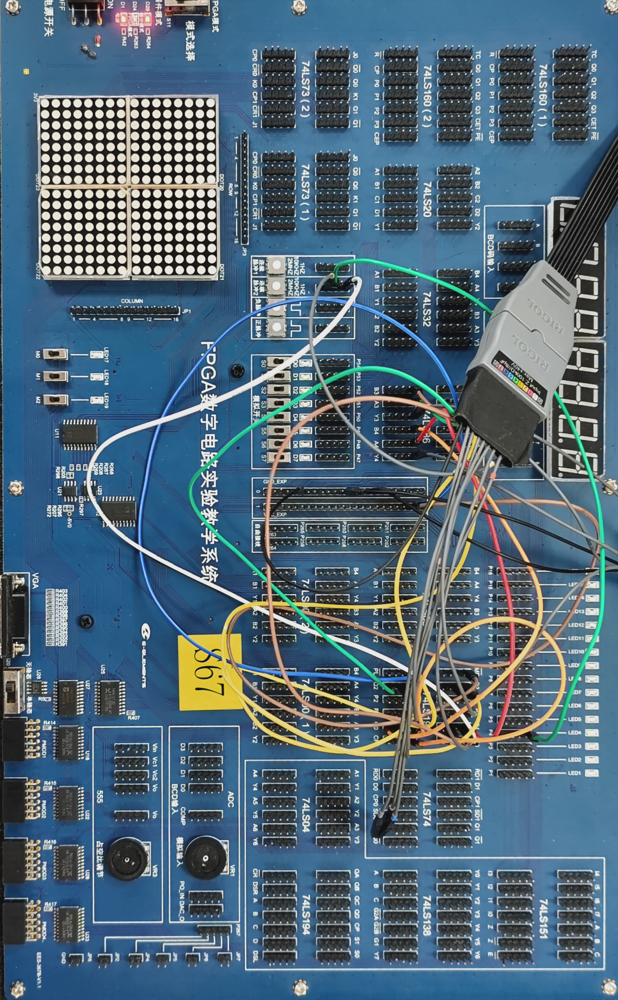

# 实验四 组合逻辑电路分析与设计

SID: 24344064

Name: 廖海涛

## 一、实验题目

设计二进制码到格雷码的代码转换电路

## 二、实验目的

1. 掌握组合逻辑电路的分析方法，并验证其逻辑功能
2. 掌握组合逻辑电路的设计方法，并能用最少的逻辑门实现之
3. 熟悉逻辑分析仪的使用

## 三、实验设备

1. 数字电路实验箱
2. 逻辑分析仪
3. 器件：74LS86（异或门）、74LS197（计数器）

## 四、实验原理

### 4.1 组合逻辑电路设计方法

组合逻辑电路的设计步骤如下：

1. 根据给定事件的因果关系列出真值表
2. 由真值表写出函数式
3. 对函数式进行化简或变换
4. 画出逻辑图，并测试逻辑功能

### 4.2 二进制码与格雷码

格雷码（Gray Code）也称循环码，其最大特点是相邻两个代码之间只有一位发生变化，避免了过渡"噪声"。4位二进制码与格雷码的对照关系如下表：

| 十进制 | 二进制码 Q3Q2Q1Q0 | 格雷码 G3G2G1G0 |
|--------|-------------------|-----------------|
| 0      | 0000              | 0000            |
| 1      | 0001              | 0001            |
| 2      | 0010              | 0011            |
| 3      | 0011              | 0010            |
| 4      | 0100              | 0110            |
| 5      | 0101              | 0111            |
| 6      | 0110              | 0101            |
| 7      | 0111              | 0100            |
| 8      | 1000              | 1100            |
| 9      | 1001              | 1101            |
| 10     | 1010              | 1111            |
| 11     | 1011              | 1110            |
| 12     | 1100              | 1010            |
| 13     | 1101              | 1011            |
| 14     | 1110              | 1001            |
| 15     | 1111              | 1000            |

### 4.3 转换电路设计

根据真值表分析，可得到二进制码到格雷码的转换公式：

- G3 = Q3
- G2 = Q3 ⊕ Q2
- G1 = Q2 ⊕ Q1
- G0 = Q1 ⊕ Q0

该电路可以使用异或门（74LS86）实现。最高位直接输出，其余各位由相邻高位与本位异或得到。

## 五、实验方法与步骤

### 5.1 电路设计与仿真

使用Proteus软件设计二进制码到格雷码转换电路，电路主要由3个异或门组成：

- G3直接连接Q3
- G2由Q3和Q2经过异或门得到
- G1由Q2和Q1经过异或门得到
- G0由Q1和Q0经过异或门得到

### 5.2 静态测试

使用实验箱上的逻辑电平开关作为4位二进制码输入（Q3、Q2、Q1、Q0），将输出（G3、G2、G1、G0）接LED显示器。按照真值表逐一输入各种二进制码组合，观察输出的格雷码是否正确。测试结果表明电路工作正常，输出与理论值完全一致。

### 5.3 动态测试

1. 首先测试74LS197十六进制计数器，将其输出Q3、Q2、Q1、Q0接"0-1"显示器，CP0接手动负脉冲，验证计数器功能正常

2. 将10KHz连续脉冲接入74LS197的CP0端作为计数脉冲，将74LS197的Q3、Q2、Q1、Q0连接到代码转换电路的输入端

3. 使用逻辑分析仪（示波器数字通道）观察并记录CP、Q3、Q2、Q1、Q0和G3、G2、G1、G0的波形

## 六、实验结果与验证

### 6.1 波形分析

使用示波器观察到的波形如下图所示：

从波形图可以观察到：

1. **时钟信号CP**（D0）：10KHz方波，作为74LS197的计数脉冲
2. **二进制输出Q3-Q0**（Q0=D1, Q1=D2, Q2=D3, Q=4D4）：74LS197的输出按标准二进制序列变化（0000→0001→0010→...→1111）
3. **格雷码输出G3-G0**（D8=G0, D9=G1, D10=G2, D11=G3）：每次只有一位发生变化，体现了格雷码的特性

### 6.2 关键特性验证

通过波形分析验证了格雷码的核心特性：

- 相邻两个格雷码之间只有一位变化
- 例如从0000（二进制0）到0001（二进制1）时，格雷码从0000变为0001，只有G0变化
- 从0001（二进制1）到0010（二进制2）时，格雷码从0001变为0011，只有G1变化

## 七、分析与讨论

### 7.1 电路功能分析

本实验成功设计并实现了二进制码到格雷码的转换电路。通过使用异或门，电路结构简洁高效，仅需3个异或门即可完成4位代码转换。

### 7.2 格雷码的优势

格雷码相比普通二进制码的主要优势：

1. **抗干扰性强**：相邻码字只有一位变化，减少了跳变时的过渡噪声
2. **可靠性高**：在机械编码器等应用中，减少了读数错误的可能性
3. **循环特性**：首尾代码也只有一位差异，适合循环计数应用

### 7.3 实验中的问题与解决

1. 静态测试时需要仔细核对每一种输入组合，确保测试的完整性
2. 动态测试时注意观察波形的相位关系，验证格雷码的单位变化特性
3. 示波器通道设置要合理，确保能同时观察到所有关键信号

### 7.4 设计方法总结

组合逻辑电路的设计遵循系统化的方法：

1. **真值表**：明确输入输出关系
2. **逻辑表达式**：从真值表推导布尔函数
3. **化简优化**：使用卡诺图或代数法化简
4. **电路实现**：选择合适的逻辑门器件
5. **测试验证**：静态和动态测试相结合

## 八、实验心得

通过本次实验，我深入理解了组合逻辑电路的设计流程，掌握了从真值表到逻辑表达式再到实际电路的完整设计过程。格雷码转换电路虽然简单，但充分体现了数字电路设计的基本思想。

实验中使用Proteus仿真和实际硬件测试相结合的方法，既验证了设计的正确性，又锻炼了动手能力。特别是使用逻辑分析仪观察波形，直观地看到了格雷码"相邻单变"的特性，加深了对理论知识的理解。

此外，实验过程中还熟悉了74LS197计数器的使用方法，为后续更复杂的时序电路实验打下了基础。组合逻辑电路设计的系统化方法可以推广到更复杂的电路设计中，具有很强的实用价值。
