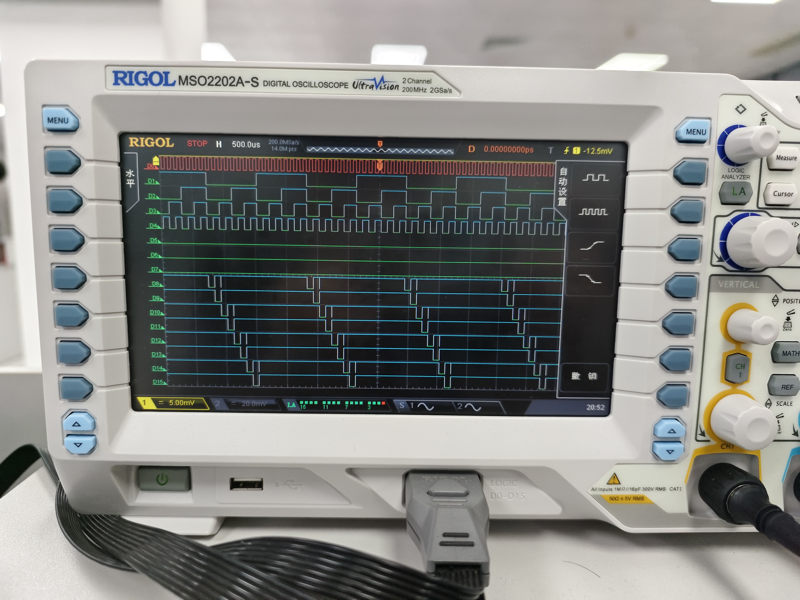
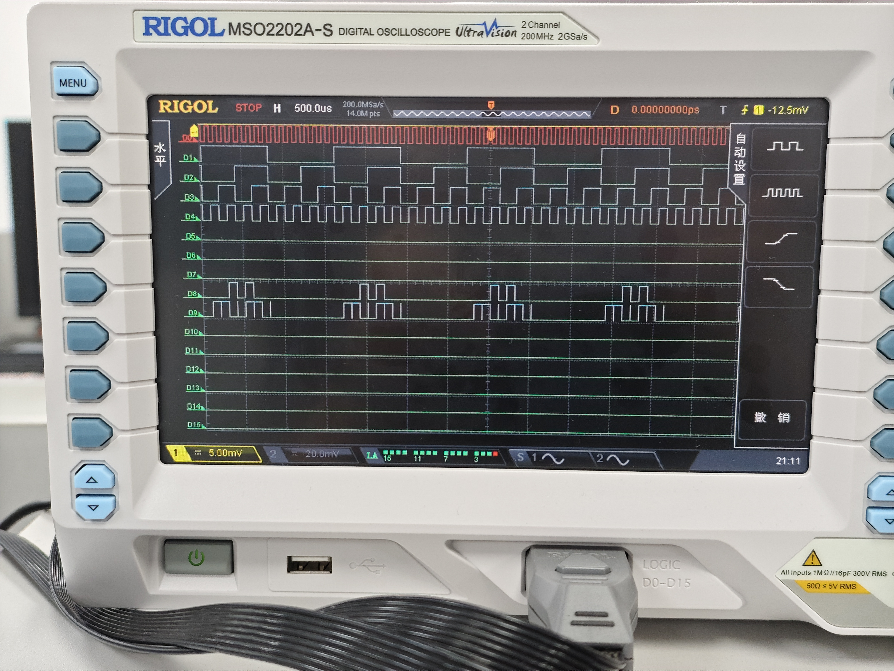
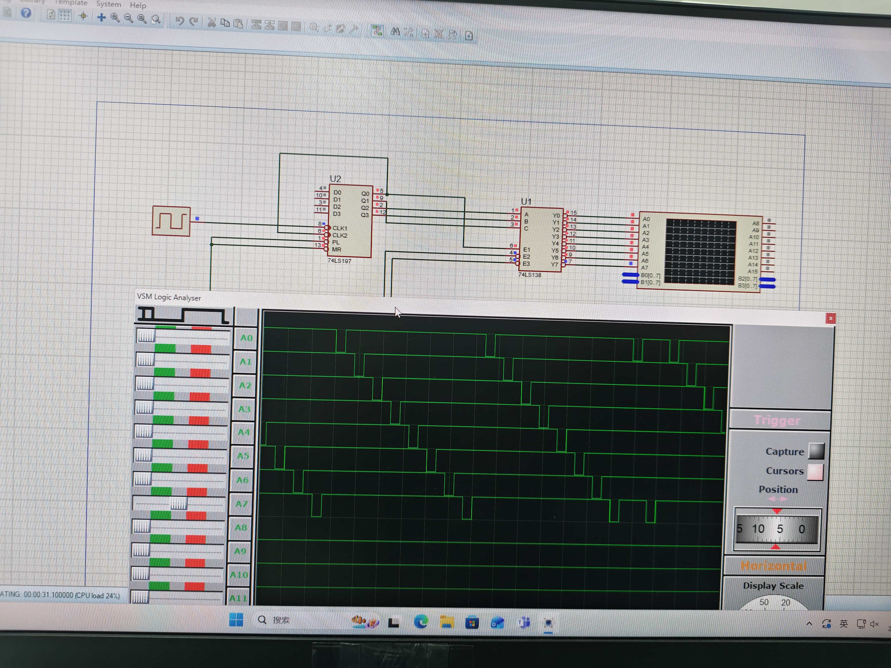

# 实验五 译码器电路原理及应用

## 一、实验题目

74LS138译码器功能测试及算术单元设计

## 二、实验目的

1. 熟悉译码器的功能与使用方法
2. 掌握用中规模集成电路（MSI）设计组合逻辑电路的方法
3. 学习使用译码器实现算术逻辑单元

## 三、实验设备

1. 数字电路实验箱
2. 逻辑分析仪（示波器）
3. 器件：74LS00（与非门）、74LS138（3-8线译码器）、74LS197（计数器）

## 四、实验原理

### 4.1 74LS138译码器

74LS138是常见的3-8线译码器，将3位二进制输入译成8个低电平输出信号中的一个。其特点：

- 输入端：C、B、A（地址输入）和G1、G̅2̅A̅、G̅2̅B̅（使能端）
- 输出端：Y0~Y7（低电平有效）
- 使能条件：G1=1，G̅2̅A̅=0，G̅2̅B̅=0

### 4.2 真值表

当使能端有效时，74LS138的输出表达式为：

- Y̅0̅ = C̅B̅A̅ = m0
- Y̅1̅ = C̅B̅A = m1
- Y̅2̅ = C̅BA̅ = m2
- Y̅3̅ = C̅BA = m3
- Y̅4̅ = CB̅A̅ = m4
- Y̅5̅ = CB̅A = m5
- Y̅6̅ = CBA̅ = m6
- Y̅7̅ = CBA = m7

由于输出是三变量的全部最小项，因此74LS138也称为最小项译码器。

### 4.3 使用74LS138实现组合逻辑电路

利用74LS138实现组合逻辑电路的方法：

1. 根据逻辑功能列出真值表
2. 写出最小项之和表达式
3. 将表达式转换为与非形式
4. 用附加门电路将74LS138的相应输出组合

### 4.4 带控制端的半加半减器设计

设计要求：输入S、A、B，输出Y和Cn

- 当S=0时：执行加法，Y=A+B，Cn为进位
- 当S=1时：执行减法，Y=A-B，Cn为借位

真值表如下：

| S | A | B | Y | Cn |
|---|---|---|---|----|
| 0 | 0 | 0 | 0 | 0  |
| 0 | 0 | 1 | 1 | 0  |
| 0 | 1 | 0 | 1 | 0  |
| 0 | 1 | 1 | 0 | 1  |
| 1 | 0 | 0 | 0 | 0  |
| 1 | 0 | 1 | 1 | 1  |
| 1 | 1 | 0 | 1 | 0  |
| 1 | 1 | 1 | 0 | 0  |

根据真值表可得：

- Y = m1 + m2 + m5 + m6 = Y̅1̅ · Y̅2̅ · Y̅5̅ · Y̅6̅
- Cn = m3 + m5 = Y̅3̅ · Y̅5̅

## 五、实验方法与步骤

### 5.0 使用74LS197构成4位计数器

实验中使用74LS197作为信号源，其配置为16进制计数器模式：

- CP0接时钟脉冲（手动或10KHz）
- MR接高电平（禁止清零）
- PL接高电平（禁止预置）
- 输出Q3、Q2、Q1、Q0按二进制序列计数

74LS197 作为 4 位计数器正常工作。

### 5.1 74LS138静态测试

1. 将74LS138使能端G̅2̅A̅、G̅2̅B̅接低电平（GND）
2. 使用实验箱上的逻辑开关作为输入C、B、A和G1
3. 将输出Y0~Y7接LED显示器
4. 按真值表逐一测试各种输入组合，验证输出是否正确

测试结果表明74LS138工作正常，输出与真值表完全一致。

### 5.2 74LS138动态测试（实验内容2-3）

1. **计数器测试**：首先测试74LS197十六进制计数器，CP0接手动脉冲，验证计数功能正常

2. **配置1**：将74LS138的G̅2̅A̅、G̅2̅B̅接低电平，74LS197的Q3、Q2、Q1、Q0依次连接到74LS138的G1、C、B、A

3. 将10KHz脉冲接入74LS197的CP0，使用示波器观察CP0（D0）、G1（D1）、C（D2）、B（D3）、A（D4）和Y0~Y7（D8~D15）的波形

从波形可以看出：

- 74LS197按二进制顺序计数
- 当输入地址变化时，对应的输出线Y0~Y7依次输出低电平
- 当 G1（D1）为低电平时，输出线Y0~Y7均为高电平
- 译码功能正确实现

### 5.3 74LS138动态测试（实验内容2-4）

配置2：

- G1接高电平
- G̅2̅A̅、G̅2̅B̅均与Q3相连（用Q3控制使能）
- Q2、Q1、Q0依次连接到C、B、A

这种配置下，只有当Q3=0时译码器才工作，相当于实现了4-16线译码器的低8位。

示波器的波形和电路对应为，CP0=D0，Q3=D1，Q2=C=D2，Q1=B=D3，Q0=A=D4，Y0~Y7=D8~D15。

观察到：

- 当Q3=0时（计数值0~7），Y0~Y7依次输出低电平
- 当Q3=1时（计数值8~15），所有输出保持高电平，译码器被禁止
- 体现了使能端的控制作用

### 5.4 使用74LS138设计算术单元（AU）

根据半加半减器的真值表，使用74LS138实现：

- 将S、A、B连接到74LS138的C、B、A
- Y输出：使用与非门连接Y̅1̅、Y̅2̅、Y̅5̅、Y̅6̅
- Cn输出：使用与非门连接Y̅3̅、Y̅5̅

电路实现后进行动态测试，将74LS197计数器连接到AU的输入端，观察波形。

波形分析：

- D0=CP0, D1=G1, D2=S, D3=A, D4=B, D8=Cn, D9=Y
- 时钟脉冲驱动计数器产生不同的S、A、B组合
- 输出Y按照半加/半减逻辑正确变化
- 进/借位Cn在需要时正确产生

### 5.5 Proteus 软件仿真分析

## 六、实验结果与验证

### 6.1 静态测试结果

静态测试验证了74LS138的基本译码功能，所有输入组合下的输出均与真值表一致，电路工作正常。

### 6.2 动态测试结果

1. **基本译码功能**：74LS138能正确将3位二进制输入译成8个输出之一
2. **使能控制**：使能端能有效控制译码器的工作状态
3. **时序关系**：输出波形的相位关系符合译码逻辑

### 6.3 算术单元验证

使用74LS138设计的半加半减器功能正确：

- S=0时正确执行半加法运算
- S=1时正确执行半减法运算
- 进位/借位输出正确

## 七、分析与讨论

### 7.1 使用MSI实现组合电路的优势

1. **集成度高**：一片74LS138相当于多个门电路，减少了芯片数量
2. **设计简化**：利用最小项译码特性，只需添加少量门电路即可实现复杂功能
3. **可靠性好**：MSI芯片经过充分测试，可靠性高于分立门电路
4. **布线简化**：芯片数量少，连线简单，减少了出错可能

### 7.2 与门电路实现方法的比较

**使用74LS138的优点**：

- 对于3变量函数，无需化简即可直接从最小项实现
- 电路结构规整，便于扩展
- 适合多输出函数的实现

**使用门电路的优点**：

- 对于简单函数可能更经济
- 灵活性更高
- 可以充分化简，减少门电路数量

### 7.3 使能端的作用

使能端在实际应用中非常重要：

1. **芯片选择**：在多片级联时选择工作的芯片
2. **扩展功能**：通过使能端可以将多片3-8译码器扩展为更大的译码器
3. **附加输入**：G1可作为第四个输入变量，扩展逻辑功能

### 7.4 实验中遇到的问题

1. 接线时要特别注意使能端的有效电平（低电平有效需接地）
2. 动态测试时示波器通道要合理分配，关键信号要同时观察
3. 74LS197是下降沿触发，接线时要注意时钟极性

## 八、思考与提高

### 8.1 4-16线译码器的实现

使用两片74LS138可以实现4-16线译码器：

- 第一片：A3接G̅2̅A̅，A2A1A0接CBA，输出Y0~Y7
- 第二片：A̅3̅接G̅2̅A̅（通过非门），A2A1A0接CBA，输出Y8~Y15
- 当A3=0时第一片工作，A3=1时第二片工作

### 8.2 设计方法总结

使用MSI器件设计组合逻辑电路的一般步骤：

1. 分析逻辑功能，列真值表
2. 写出最小项表达式
3. 根据MSI器件特性转换表达式形式
4. 添加必要的附加门电路
5. 进行静态和动态测试验证

## 九、实验心得

本次实验让我深入理解了译码器的工作原理和应用方法。74LS138作为最小项译码器，为实现三变量组合逻辑函数提供了一种规范化的方法。

通过设计半加半减器，我体会到了MSI器件在组合电路设计中的优势。虽然使用门电路也能实现相同功能，但使用74LS138使设计思路更清晰，电路结构更规整。

实验中使用74LS197计数器作为信号源，配合示波器观察动态波形，直观地验证了电路功能。静态测试和动态测试相结合的方法，既保证了测试的完整性，又提高了测试效率。

此外，实验还锻炼了我使用逻辑分析仪的能力，学会了如何观察和分析多路数字信号的时序关系。这些技能对于以后学习更复杂的数字系统非常重要。

通过本次实验，我认识到数字电路设计不仅需要扎实的理论基础，还需要灵活运用各种MSI/LSI器件，选择最合适的实现方案。
