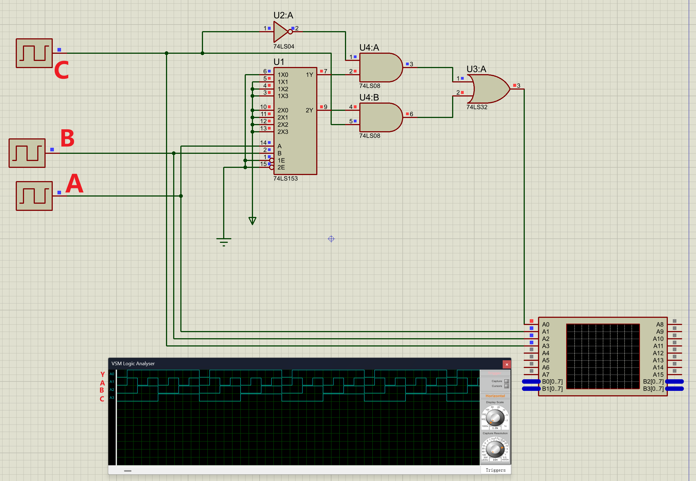
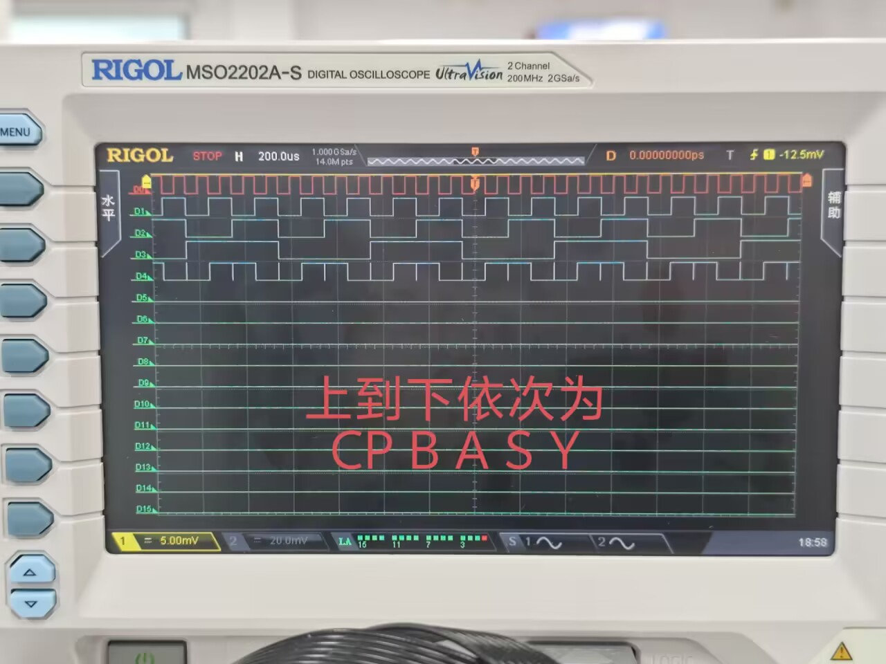
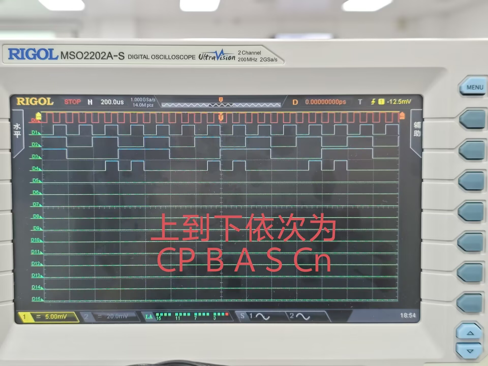
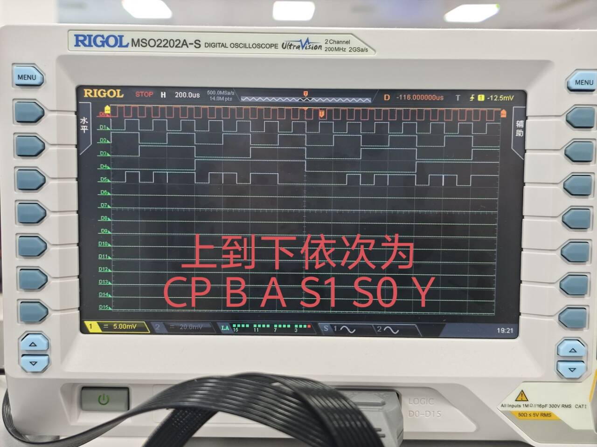

# 数字电路实验报告（实验六）

**姓名：**廖海涛  
**学号：**24344064  
**日期：**2026-04-14

## 一、实验题目

数据选择器电路原理及应用（74LS151）

## 二、实验目的

1. 熟悉 74LS151（八选一数据选择器）的功能与使用方法。  
2. 掌握基于 MSI 器件实现组合逻辑电路的设计方法。  
3. 完成 AU（半加半减器）与 LU（逻辑单元）两类组合逻辑功能设计与验证。

## 三、实验设备

1. 数字电路实验箱、示波器（数字通道）。  
2. 芯片：74LS151、74LS00、74LS197。  
3. Proteus 仿真环境（预习与电路验证）。

## 四、实验原理

74LS151 在使能端有效时，由地址输入 \(C,B,A\) 在 \(D_0\sim D_7\) 中选择一路输出到 \(Y\)。因此可将 \(C,B,A\) 作为变量输入，把 \(D_0\sim D_7\) 预置为常量 0/1 或变量/反变量，从而在输出端实现目标组合逻辑函数。

本实验采用该思想完成两项设计：

1. **AU（带控制端半加半减器）**：输入 \(S,A,B\)，当 \(S=0\) 实现加法（输出和及进位），当 \(S=1\) 实现减法（输出差及借位）。  
2. **LU（函数发生器）**：输入 \(S_1,S_0,A,B\)，输出分别实现 \(A\cdot B\)、\(A+B\)、\(A\oplus B\)、\(\overline{A}\)。

此外，在 Proteus 中使用 74LS153（双四选一）与门级组合实现等效八选一结构，用于加深对数据选择器结构化实现方法的理解。

根据推导，74LS153 搭建 8 选 1 的关键关系为：
\[
\text{Output}= \overline{C}\,X + C\,Y
\]
其中 \(X,Y\) 分别为两个 4 选 1 子模块输出，\(C\) 作为片选输入。

## 五、方法与步骤

1. 根据实验指导书功能表，先确定各功能对应真值关系。  
2. 选取 74LS151 的地址端作为控制/输入变量，将数据端 \(D_0\sim D_7\) 按目标函数逐项配置。  
3. 在实验箱上完成 AU 连线，分两次记录：  
   1. 和/差输出 \(Y\)；  
   2. 进/借位输出 \(Cn\)。  
4. 在实验箱上完成 LU 连线，按 \(S_1S_0=00,01,10,11\) 分别验证与、或、异或、非功能。  
5. 进行静态测试与动态测试：静态逐项核对逻辑关系；动态使用时钟驱动并采集关键信号波形。

其中，关键映射如下：

1. **AU（令地址端 \(C,B,A \leftarrow S,A,B\)）**  
   由真值表得到：  
   \(Y\) 对应 \(D_0\sim D_7 = [0,1,1,0,0,1,1,0]\)；  
   \(Cn\) 对应 \(D_0\sim D_7 = [0,0,0,1,0,1,0,0]\)。
2. **LU（令地址端 \(C,B,A \leftarrow S_1,A,B\)）**  
   草稿推导得到：  
   \(D_0\sim D_7 = [0,S_0,S_0,\overline{S_0},S_0,1,\overline{S_0},\overline{S_0}]\)。

## 六、验证（结果）

### 1. AU（半加半减器）

- **静态测试：**各输入组合下输出与功能表一致，结果正常。  
- **动态测试：**采集到输出 \(Y\) 与 \(Cn\) 波形，随 \(S,A,B\) 的变化按预期切换。

### 2. LU（逻辑单元）

- **静态测试：**四种功能选择下输出逻辑正确，结果正常（已通过）。  
- **动态测试：**在时钟驱动下，\(Y\) 波形与 \(S_1,S_0,A,B\) 对应功能关系一致。

### 3. 波形关系说明

动态测试中，输出信号在输入组合稳定后发生对应电平变化；不同功能选择码下输出遵循相应逻辑运算关系，体现了数据选择器“地址选通 + 数据预置”实现组合逻辑的本质。

## 七、分析与讨论

1. 使用 74LS151 设计组合逻辑时，核心是把函数映射为“地址变量 + 数据端赋值”，设计流程清晰、复用性高。  
2. 与纯门电路实现相比，MSI 方案连线更规整、调试更集中；但对数据端赋值正确性要求高，初次设计易在真值映射处出错。  
3. 本实验中通过 AU 与 LU 两个实例验证了同一器件可实现多类组合逻辑，说明组合逻辑设计的关键在于函数分解与编码映射。  
4. 结合仿真与实测波形，电路功能与理论分析一致，达到了实验目标。
