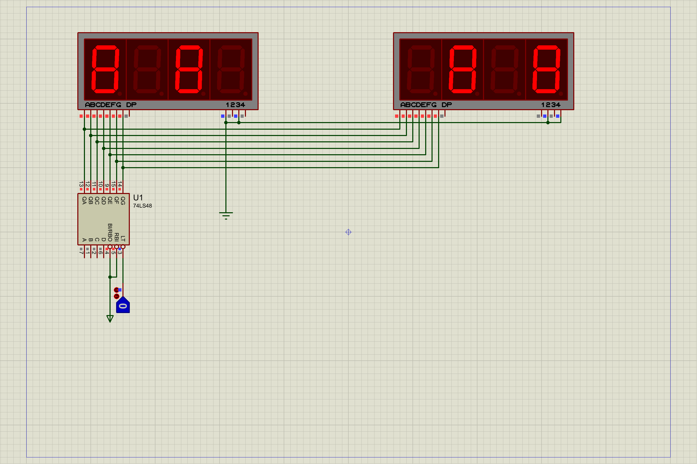
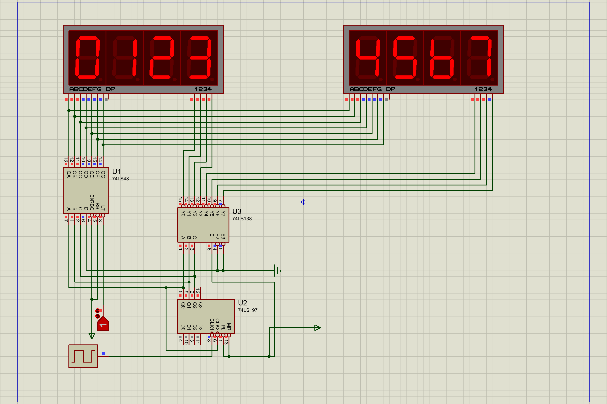
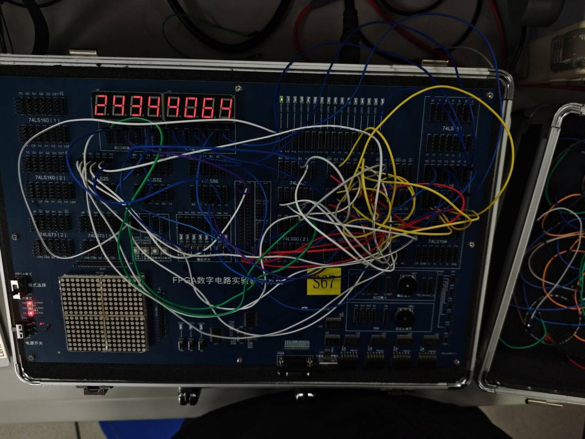

# 数字电路实验报告（实验七）

**姓名：**廖海涛  
**学号：**24344064  
**日期：**2026-04-14

## 一、实验题目

译码显示电路（1）：数码管的扫描式显示

## 二、实验目的

1. 掌握中规模集成译码器（74LS138 等）的逻辑功能与使用方法。  
2. 掌握 8 位共阴极数码管扫描显示的实现思路。  
3. 完成学号 `24344064` 的硬件扫描显示。

## 三、实验设备

1. 数字电路实验箱、示波器。  
2. 器件：七段数码管、74LS138、74LS00、74LS197。  
3. Proteus 仿真环境（7SEG-MPX4-CC、74LS48 等）。

## 四、实验原理

4 联装共阴极数码管每位共用 a-g 段线，通过位选端（低电平有效）逐位选通。  
扫描显示的核心是“**位选信号**”与“**该位对应 8421 码**”同步送出：在任一时刻仅点亮一位，但因视觉暂留表现为多位同时显示。

本实验用计数器提供扫描节拍，位选逻辑选择 8 个数码管位置，8421 码通道按扫描位送出目标数字，实现学号稳定显示。

## 五、方法与步骤

1. 在 Proteus 先搭建两片 4 联装共阴极数码管 + 译码驱动电路，验证 8 位结构可正常工作。  
2. 在仿真中实现 0~7 扫描显示，确认位选与数据同步关系。  
3. 在实验箱上搭建学号显示电路，使用计数器循环扫描 8 位，按位送出 `2,4,3,4,4,0,6,4` 的 8421 码。  
4. 建立状态映射（扫描状态 `Q2Q1Q0=000~111`）：  
   1. `000->2, 001->4, 010->3, 011->4, 100->4, 101->0, 110->6, 111->4`。  
   2. 对应 8421 输出位（低位到高位）可化简为：  
      - \(b_0=\overline{Q_2}Q_1\overline{Q_0}\)  
      - \(b_1=\overline{Q_0}(\overline{Q_2}+Q_1)\)  
      - \(b_2=\overline{Q_2}Q_0+Q_2Q_1+Q_2\overline{Q_0}\)  
      - \(b_3=0\)
5. 进行静态与动态测试：静态核对每位显示数字；动态观察时钟、位选、8421 码时序对应关系。

## 六、验证（结果）

### 1. Proteus 仿真验证

仿真结果显示位选轮转与 8421 码送数对应正确，扫描显示稳定。

### 2. 实验箱实测结果

实测中 8 位数码管稳定显示 `24344064`，功能正常；静态测试、动态观察结果均与设计一致。

## 七、思考与提高

**题目：**若将 74LS197 的 \(Q_2\sim Q_0\) 直接接 74LS138 输入，\(Y_0\sim Y_7\) 作为位选，当学号出现 0、8、1、9 是否会显示错误？

**回答：会。**  
原因是 74LS138 仅由 3 位输入译码，若位选由数值本身的低 3 位决定，则会发生编码重合：  
1. \(0(0000)\) 与 \(8(1000)\) 的低 3 位同为 `000`；  
2. \(1(0001)\) 与 \(9(1001)\) 的低 3 位同为 `001`。  
于是会选到同一显示位置，导致位选冲突或错位显示。

**改进：**  

1. 位选信号应由“位置计数器”独立产生（扫描序号 0~7），不要由显示数字直接决定；  
2. 8421 数据通道按位置送出对应数字；  
3. 若必须按数字译码选位，则需引入第 4 位 \(Q_3\) 参与区分（如增加译码级或门电路），消除 0/8、1/9 冲突。

## 八、分析与讨论

1. 共享段线 + 分时位选显著减少连线和器件数量，是多位数码管显示的有效方案。  
2. 扫描显示设计中，“位选”和“数据”必须严格同步；否则会出现重影、错位或亮度不均。  
3. 本实验验证了扫描式显示的工程实现流程：仿真建模、逻辑化简、硬件联调、波形对应分析。  
4. 通过加分题分析可知，位置编码与数字编码需解耦，这是避免显示冲突的关键设计原则。
