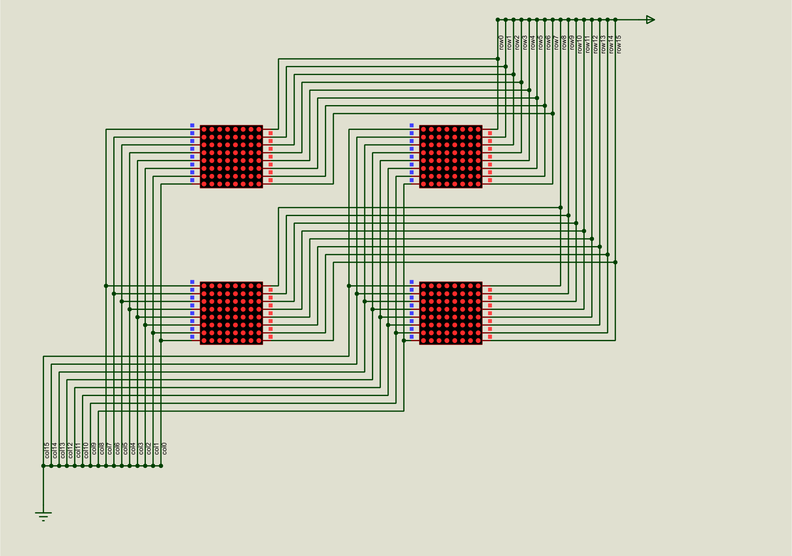
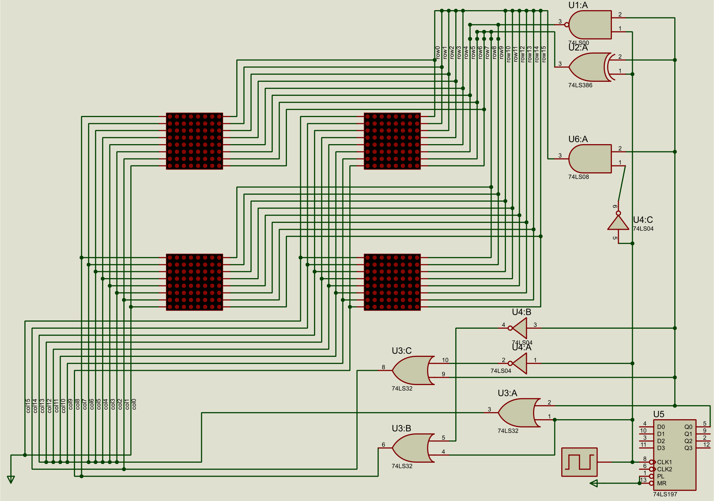
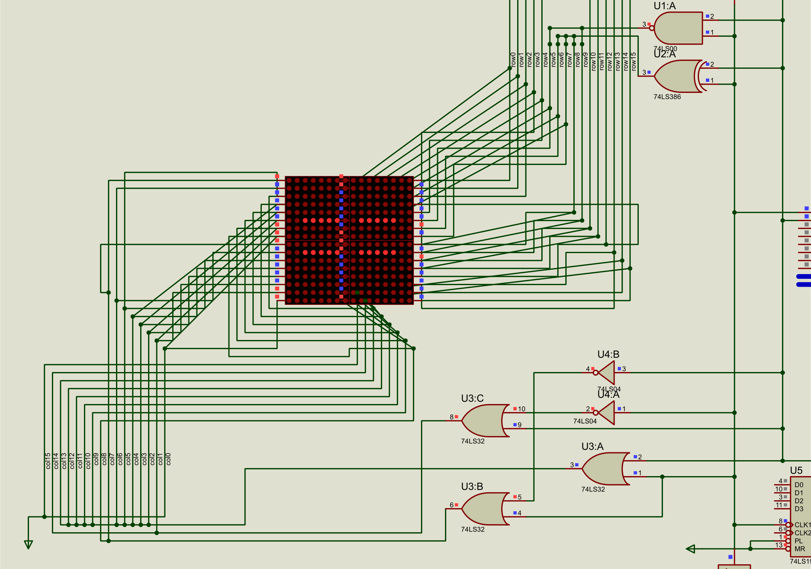
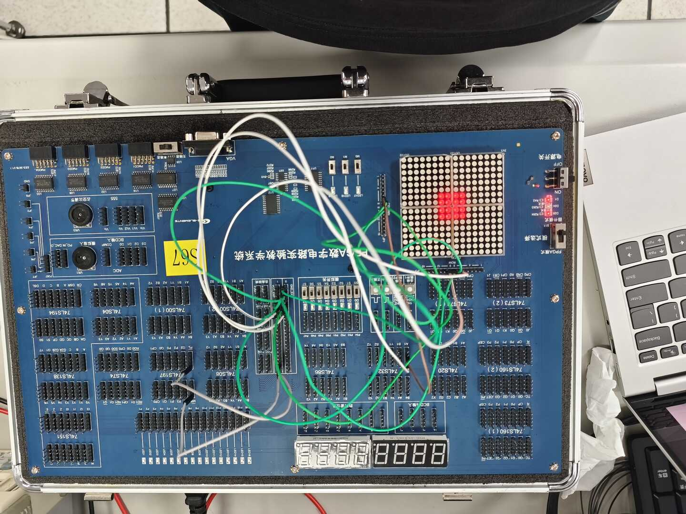
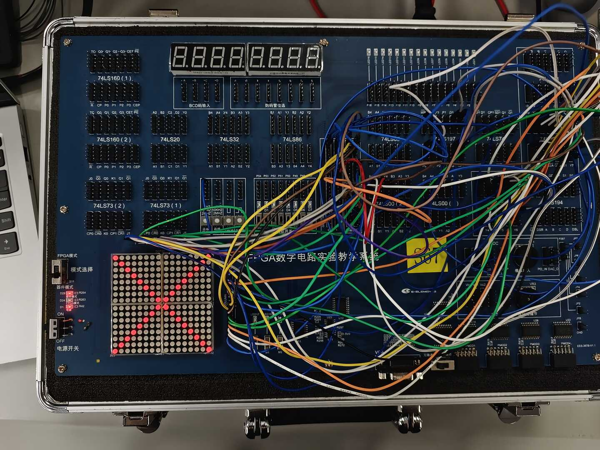
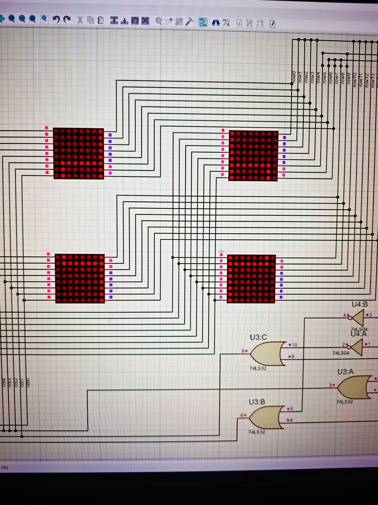

# 数字电路实验报告（实验八）

**姓名：**廖海涛  
**学号：**24344064  
**日期：**2026-04-25

## 一、实验题目

译码显示电路（2）：点阵的原理和应用

## 二、实验目的

1. 熟悉点阵显示原理与行列选通条件。  
2. 掌握 16×16 点阵扫描式显示电路设计方法。  
3. 完成固定图案显示与“X”图案显示实验。

## 三、实验设备

1. 数字电路实验箱、逻辑分析仪。  
2. 器件：16×16 点阵（由 4 片 8×8 组成）、74LS138、74LS00、74LS197。  
3. Proteus 仿真环境。

## 四、实验原理

16×16 点阵采用“行高有效、列低有效”的驱动方式：某一 LED 仅在对应行输出高电平、列输出低电平时点亮。  
显示采用扫描式驱动：按列（或按行）高速轮流选通，同时输出对应的行数据，借助视觉暂留形成稳定图案。

本实验基于列扫描实现图案显示：计数器产生扫描节拍，译码器输出列选通信号，行输出由目标图案在当前扫描列下的亮灭关系决定。对称图案可利用“对称列同时选通”简化逻辑。

## 五、方法与步骤

1. 在 Proteus 中搭建与实验箱一致的 16×16 点阵结构，确认行有效为高、列有效为低。  
2. 设计列扫描电路：用 74LS197 与 74LS138 产生列选通信号，并根据图案对称性简化驱动逻辑。  
3. 完成“中”字分帧验证：将图案拆为 3 个扫描帧，逐帧检查行列对应关系。  
4. 在实验箱完成实验内容 1（自选固定图案）：显示正方形。  
5. 在实验箱完成实验内容 2：显示“X”图案。  
6. 联调时钟频率与行列逻辑，观察显示稳定性并记录结果。

## 六、验证（结果）

### 1. 实验内容 1：自选固定图案（正方形）

实测可见正方形清晰，显示稳定，行列扫描逻辑与设计一致。

### 2. 实验内容 2：点阵显示“X”

“X”图案对称性良好，亮灭分布正确，功能正常。

### 3. 扫描显示效果补充

通过长曝光拍摄可以观察到扫描叠加后的整体图案，结果与扫描式显示原理一致。

## 七、思考与提高

### 1. 点阵采用列扫描和行扫描显示有什么区别？

两者本质一致，都是分时选通 + 另一维输出数据；区别主要在于：
1. **驱动侧不同**：列扫描时列端承担选通，行端输出数据；行扫描则相反。  
2. **电流与器件匹配不同**：被选通的一侧需要承受更集中的瞬时电流，器件选型与限流设计会不同。  
3. **逻辑组织不同**：应根据图案特征与现有芯片资源选择更易化简的一种，以减少门电路复杂度。

### 2. 如何使用点阵实现滚动图案（如沙漏）？请说明设计思路。

1. 先把每一时刻的图案编码为 16×16 位图（或按列/按行编码）。  
2. 用固定高频扫描刷新当前帧，保证视觉上连续稳定。  
3. 以较低帧率按顺序切换到下一帧，形成滚动/动画效果，并循环播放。

## 八、分析与讨论

1. 点阵显示与多位数码管扫描原理一致，关键在于“选通时序”和“数据同步”。  
2. 图案对称性可显著降低逻辑规模，是点阵电路设计中的有效优化手段。  
3. 扫描频率过低会出现闪烁，频率合适时图案稳定、亮度均匀。  
4. 实验验证了从图案映射、逻辑化简到硬件联调的完整流程，为后续动态点阵显示打下基础。
