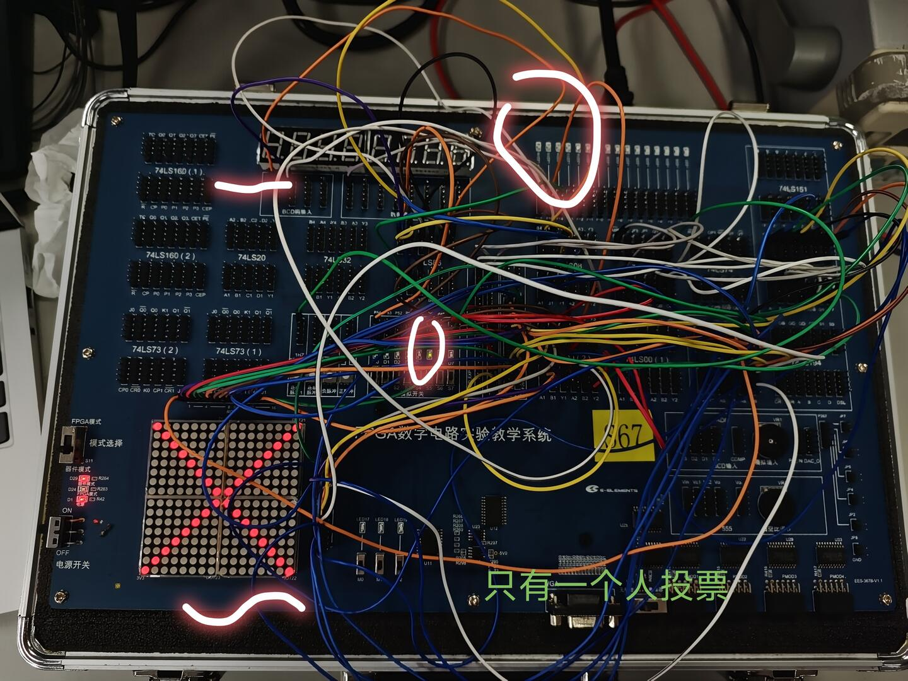
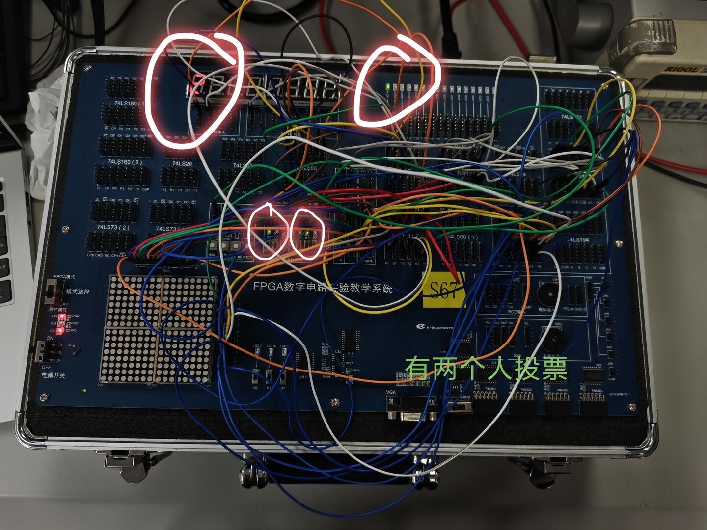
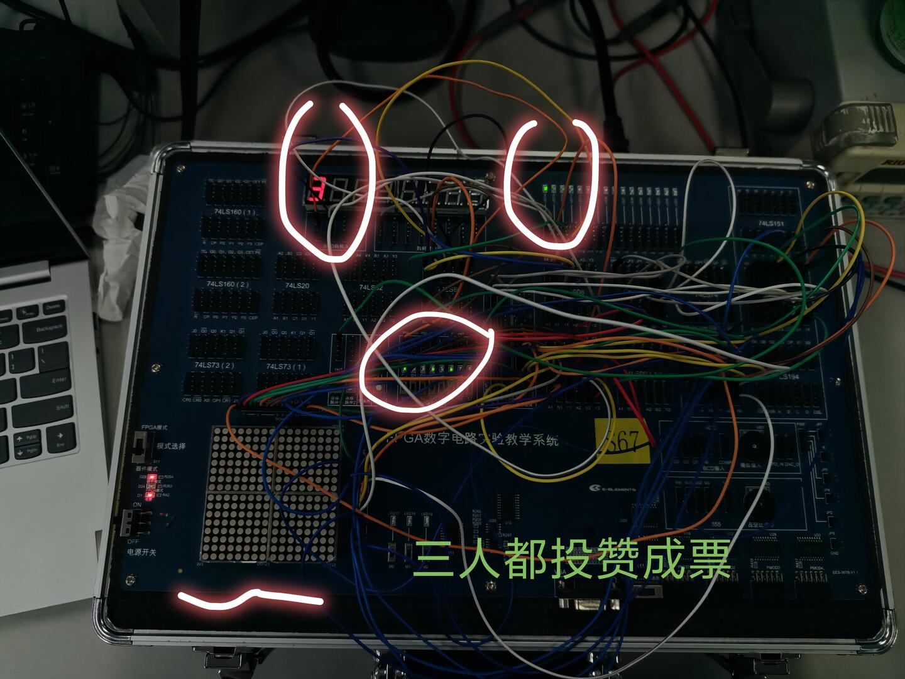
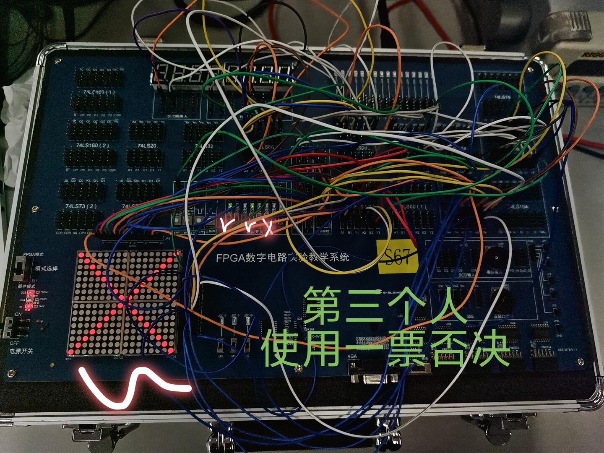

# 数字电路实验报告（实验九）

**姓名：**廖海涛  
**学号：**24344064  
**日期：**2026-04-25

## 一、实验题目

译码显示电路（3）：多数表决器的实现

## 二、实验目的

1. 掌握组合逻辑电路的设计方法。  
2. 掌握数码管与点阵的扫描式显示方法。  
3. 完成三人表决器的判定、显示与一票否决功能联调。

## 三、实验设备

1. 数字电路实验箱、逻辑分析仪。  
2. 实验箱板载 16×16 点阵、1 号 LED、1 号位七段数码管。  
3. 常用逻辑门/加法器等组合逻辑模块。

## 四、实验原理

多数表决器本质是组合逻辑判定电路：输入为各投票人的高低电平信号（高电平表示同意），输出为“通过/否决”结果。  
对三人表决器，设投票信号为 `S1、S2、S3`，通过条件为“同意票数大于 1”。

1. **多数判定逻辑**  
   可写为：
   \[
   V = S1S2 + S1S3 + S2S3
   \]
   即任意两人及以上同意时，`V=1`。

2. **显示逻辑**  
   - `V=1`：1 号 LED 点亮，点阵熄灭；  
   - `V=0`：1 号 LED 熄灭，点阵显示“X”；  
   - 在扩展功能中，`V=1` 时 1 号位数码管显示同意票数（2 或 3），`V=0` 时数码管熄灭。

3. **一票否决逻辑（以 S1 为否决权）**  
   当 `S1=0` 时直接否决；当 `S1=1` 时仍满足过半原则。可写为：
   \[
   V_{veto}=S1(S2+S3)
   \]

## 五、方法与步骤

1. 以实验箱 3 个逻辑开关作为 `S1、S2、S3` 输入，先完成三人多数表决判定逻辑。  
2. 将判定输出连接到 1 号 LED，并将否决状态连接到点阵“X”显示控制端，完成“通过亮灯、否决亮 X”联动。  
3. 在步骤 2 基础上增加同意票计数显示：统计 `S1+S2+S3`，通过时驱动 1 号位七段数码管显示 2 或 3，否决时熄灭。  
4. 在步骤 3 基础上加入一票否决条件（`S1` 为否决权），重新联调 LED、点阵与数码管显示逻辑。  
5. 通过典型投票组合（1 票同意、2 票同意、3 票同意、否决权触发）逐项观察显示结果并记录。

## 六、验证（结果）

### 1. 一票同意（未过半）

该场景下同意票未过半，表现为否决显示状态，结果与多数判定逻辑一致。

### 2. 两票同意（过半通过）

该场景下达到过半条件，LED 与显示联动正常，功能符合设计预期。

### 3. 三票同意（全票通过）

全票同意时系统稳定显示通过结果，计数显示与输入组合一致。

### 4. 一票否决触发

当具有否决权的投票人给出反对票时，系统进入否决显示状态，逻辑结果与一票否决规则一致。

## 七、思考与提高

### 1. 使用两种方式实现三人表决器功能

**方式一：逻辑表达式/卡诺图法**  
以“同意人数≥2”为输出 1 建立真值表，对 `V(S1,S2,S3)` 进行卡诺图化简，得到
`V = S1S2 + S1S3 + S2S3`。  
优点是逻辑关系直观、门级实现简单，适合输入规模较小的判定电路。

**方式二：全加器计数法**  
将 `S1、S2、S3` 作为二进制位求和，得到同意票计数（0~3），再比较“计数是否大于 1”输出通过信号。  
优点是便于扩展到更多投票人数，并可直接复用计数结果驱动数码管显示。

### 2. 两种方式对比

逻辑表达式法在三人场景下电路规模小、实现直接；全加器计数法模块化程度高，适合后续扩展 5 人或更多人表决，并且与“显示同意票数”功能耦合更自然。

## 八、分析与讨论

1. 本实验将“组合逻辑判定”与“扫描显示”结合，关键在于判定信号与显示控制信号时序一致。  
2. 多数表决与一票否决可通过条件组合实现：先给出否决约束，再进行多数判定，可减少联调歧义。  
3. 在通过/否决两种状态下分别控制 LED、点阵和数码管，有助于观察逻辑状态并快速定位接线或门级错误。  
4. 从实验结果看，三类显示装置协同工作正常，输出现象与设计逻辑一致，达到了实验要求。
